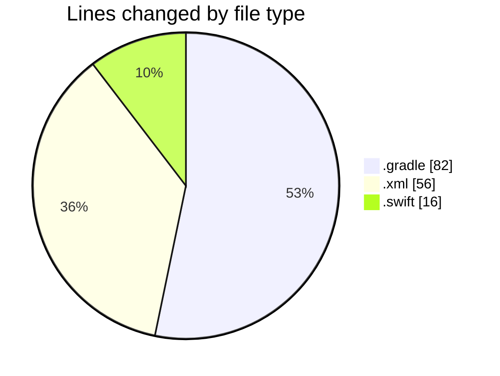
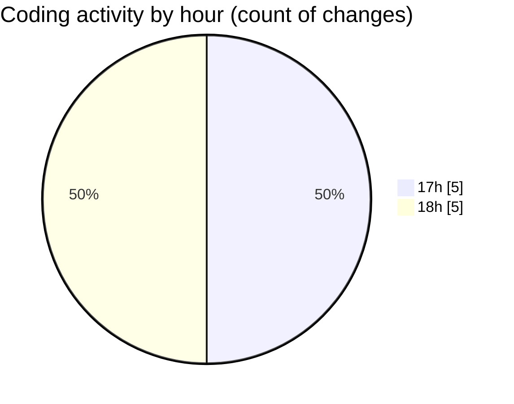

# uber_clone - Activity Summary 

## Overall Statistics

| Stat                   | Value                                                             |
| ---------------------- | ----------------------------------------------------------------- |
| **Lines Added** (➕)   | 148                                          |
| **Lines Removed** (➖) | 6                                        |
| **Net Change** (↕)    | 142                |
| **Active Time** (⌚)   | 15 minutes |

## Modified Files
- **settings.gradle** (+31, -5)
- **build.gradle** (+45, -1)
- **AndroidManifest.xml** (+56, -0)
- **AppDelegate.swift** (+16, -0)

## Visualizations

### By File Type (Lines Changed)

### By Hour (Estimated Activity Count)

> **Last Updated:** 1/1/2025, 6:13:36 PM