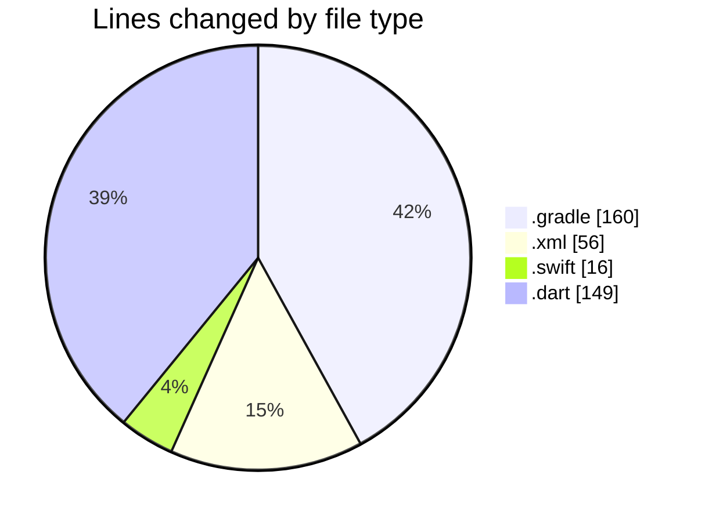
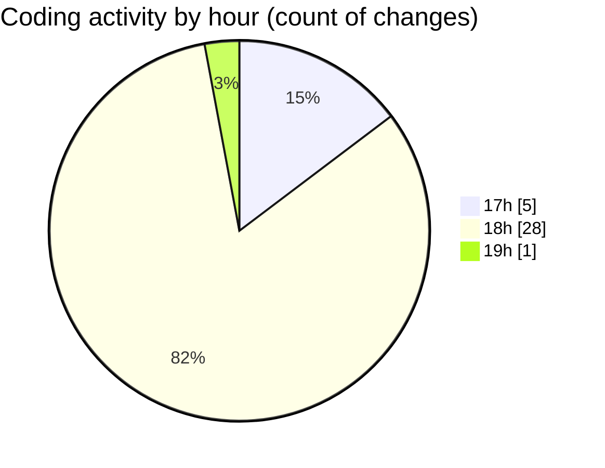

# uber_clone - Activity Summary 

## Overall Statistics

| Stat                   | Value                                                             |
| ---------------------- | ----------------------------------------------------------------- |
| **Lines Added** (➕)   | 344                                          |
| **Lines Removed** (➖) | 37                                        |
| **Net Change** (↕)    | 307                |
| **Active Time** (⌚)   | 50 minutes |

## Modified Files
- **settings.gradle** (+57, -5)
- **build.gradle** (+97, -1)
- **AndroidManifest.xml** (+56, -0)
- **AppDelegate.swift** (+16, -0)
- **home_screen.dart** (+70, -31)
- **main.dart** (+18, -0)
- **widget_test.dart** (+30, -0)

## Visualizations

### By File Type (Lines Changed)

### By Hour (Estimated Activity Count)

> **Last Updated:** 1/1/2025, 7:04:47 PM