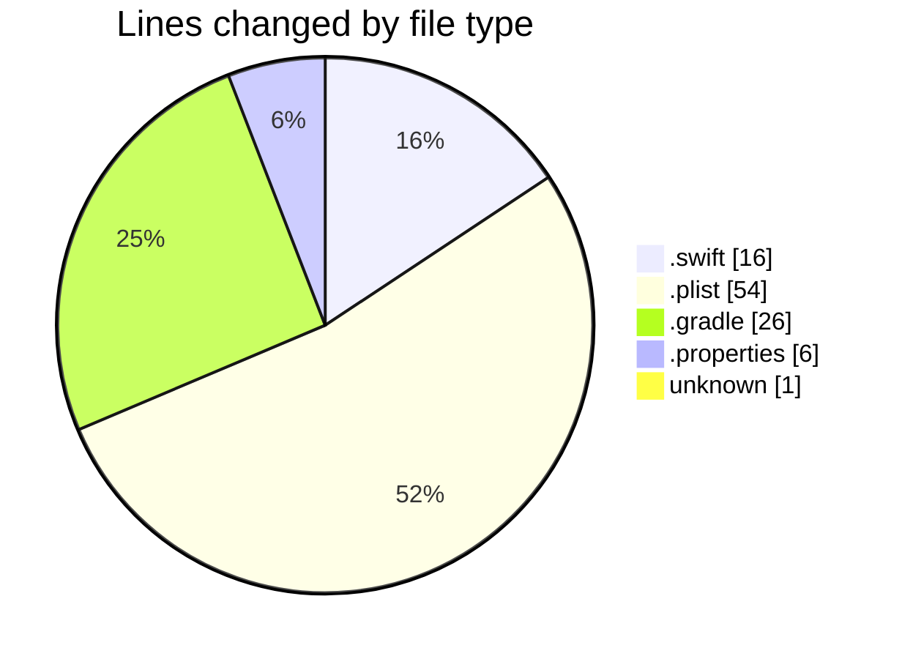
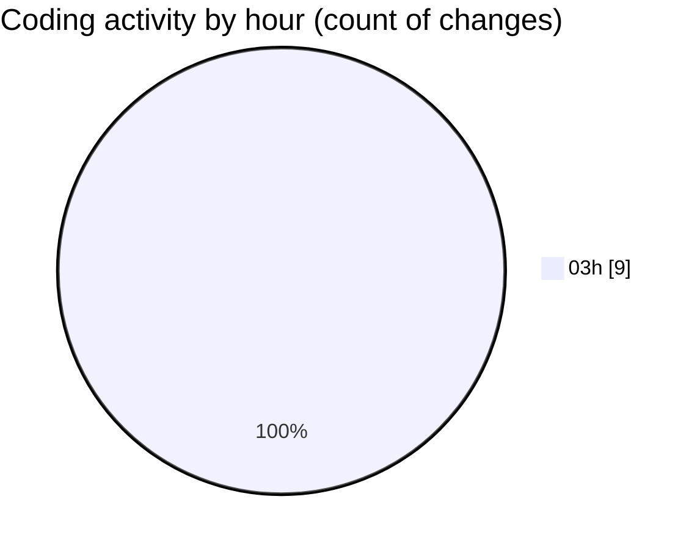

# maps_clone - Activity Summary 

## Overall Statistics

| Stat                   | Value                                                             |
| ---------------------- | ----------------------------------------------------------------- |
| **Lines Added** (➕)   | 103                                          |
| **Lines Removed** (➖) | 0                                        |
| **Net Change** (↕)    | 103                |
| **Active Time** (⌚)   | 9 minutes |

## Modified Files
- **AppDelegate.swift** (+16, -0)
- **Info.plist** (+54, -0)
- **settings.gradle** (+26, -0)
- **local.properties** (+6, -0)
- **.env** (+1, -0)

## Visualizations

### By File Type (Lines Changed)

### By Hour (Estimated Activity Count)

> **Last Updated:** 1/2/2025, 3:32:50 AM