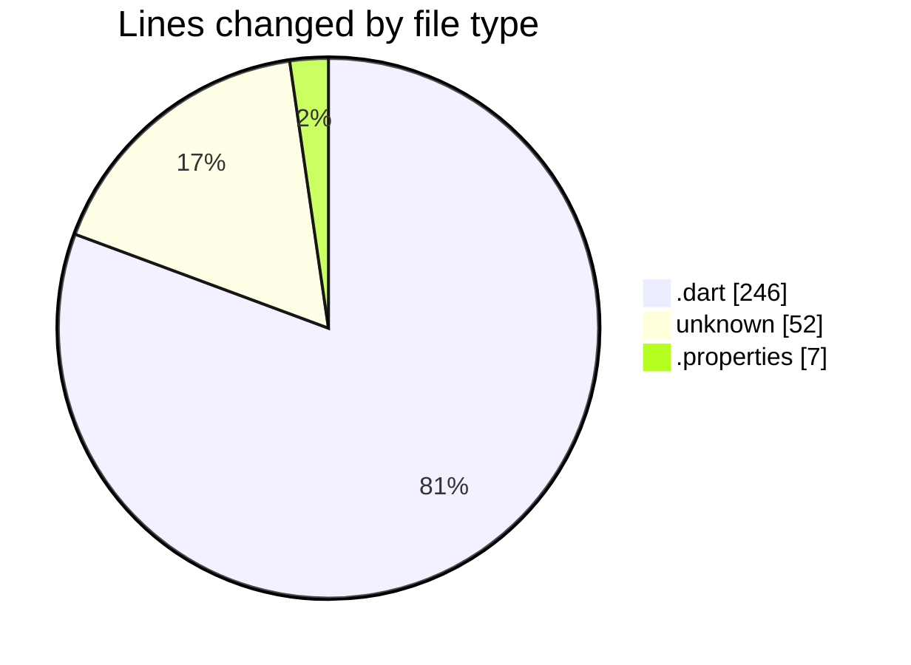
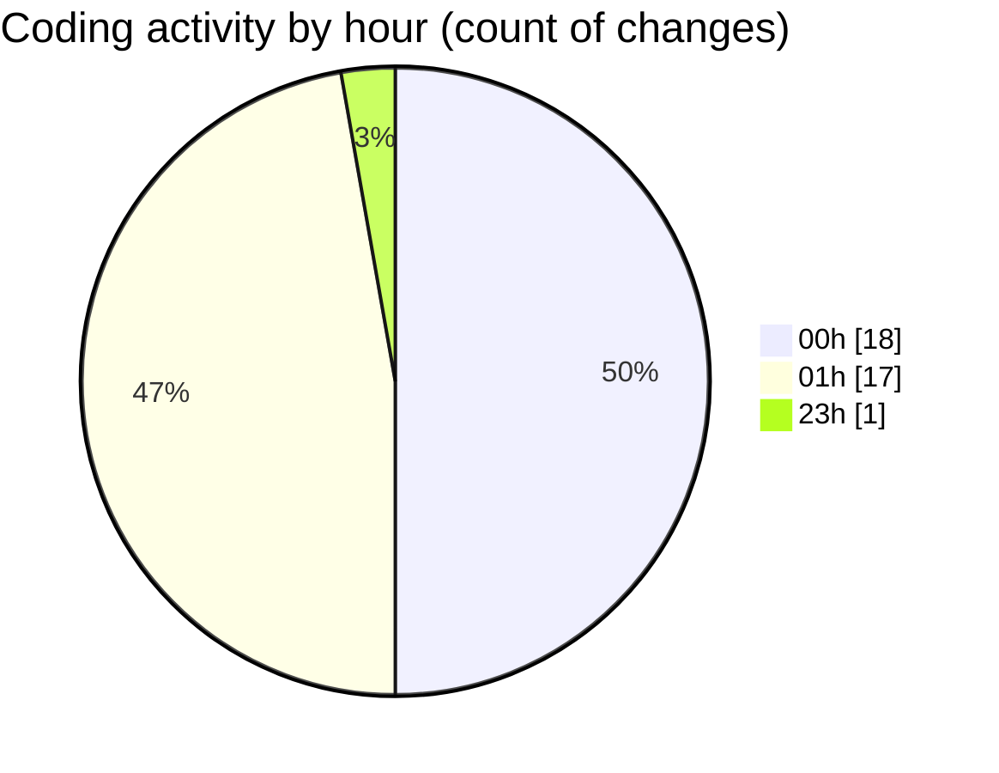

# uber_clone - Activity Summary 

## Overall Statistics

| Stat                   | Value                                                             |
| ---------------------- | ----------------------------------------------------------------- |
| **Lines Added** (➕)   | 278                                          |
| **Lines Removed** (➖) | 27                                        |
| **Net Change** (↕)    | 251                |
| **Active Time** (⌚)   | 50 minutes |

## Modified Files
- **home_screen.dart** (+198, -24)
- **consts.dart** (+2, -0)
- **.env** (+4, -1)
- **main.dart** (+20, -2)
- **.gitignore** (+47, -0)
- **local.properties** (+7, -0)

## Visualizations

### By File Type (Lines Changed)

### By Hour (Estimated Activity Count)

> **Last Updated:** 1/2/2025, 1:21:26 AM