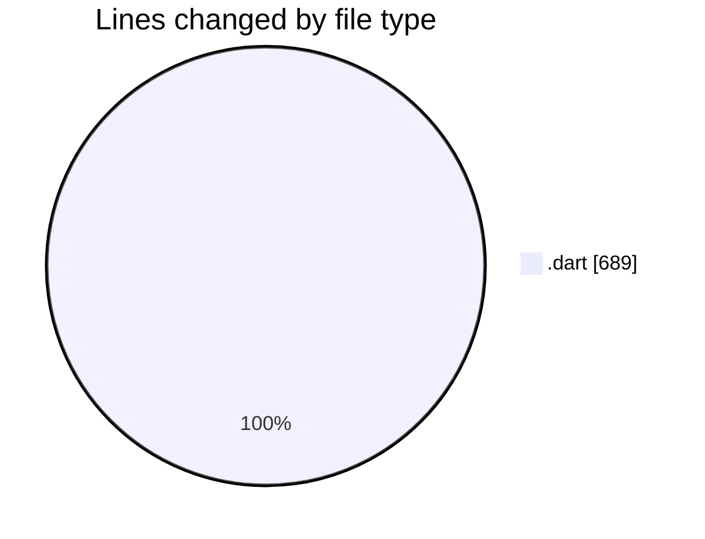
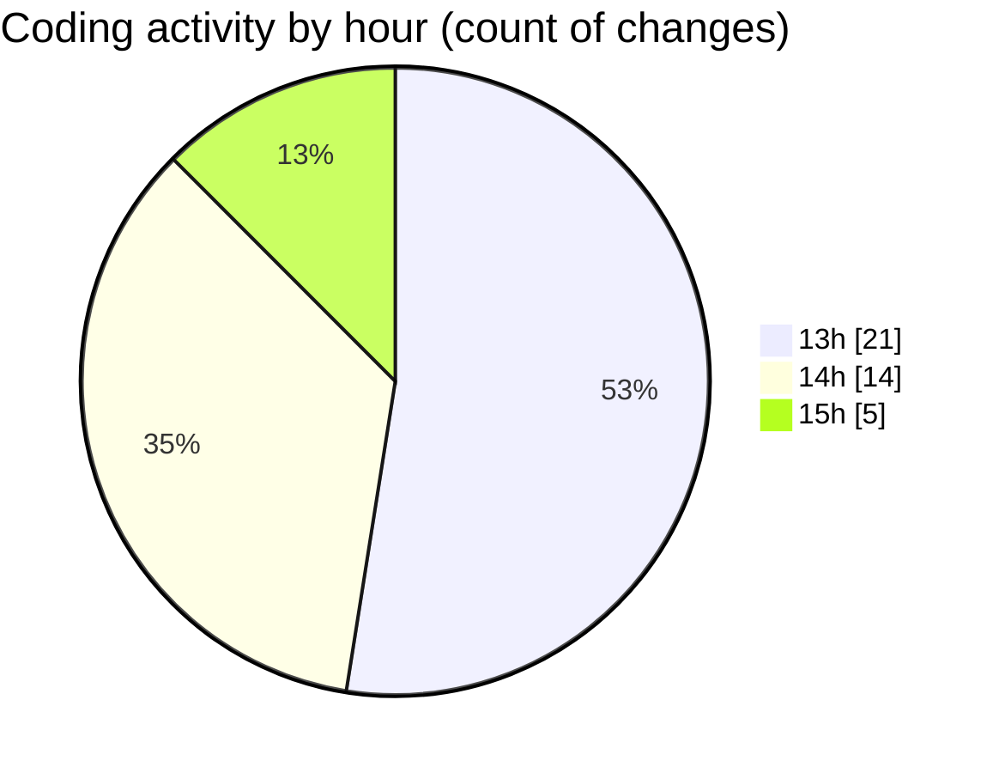

# trackers_app - Activity Summary 

## Overall Statistics

| Stat                   | Value                                                             |
| ---------------------- | ----------------------------------------------------------------- |
| **Lines Added** (➕)   | 626                                          |
| **Lines Removed** (➖) | 63                                        |
| **Net Change** (↕)    | 563                |
| **Active Time** (⌚)   | 50 minutes |

## Modified Files
- **home_screen.dart** (+155, -0)
- **show_Bottom_Sheet.dart** (+43, -0)
- **route_location.dart** (+11, -0)
- **app_routes.dart** (+29, -3)
- **my_heatmap.dart** (+49, -6)
- **heatmap_screen.dart** (+126, -53)
- **task_datasource.dart** (+119, -1)
- **task.dart** (+88, -0)
- **date_provider.dart** (+6, -0)

## Visualizations

### By File Type (Lines Changed)

### By Hour (Estimated Activity Count)

> **Last Updated:** 1/14/2025, 3:14:48 PM