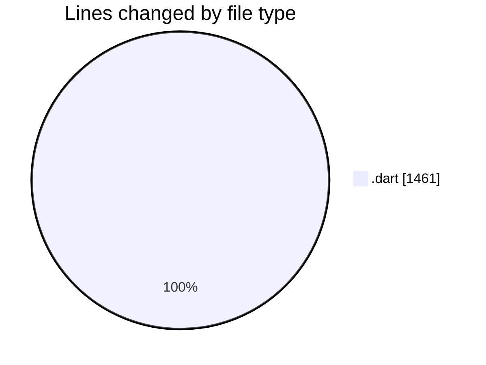
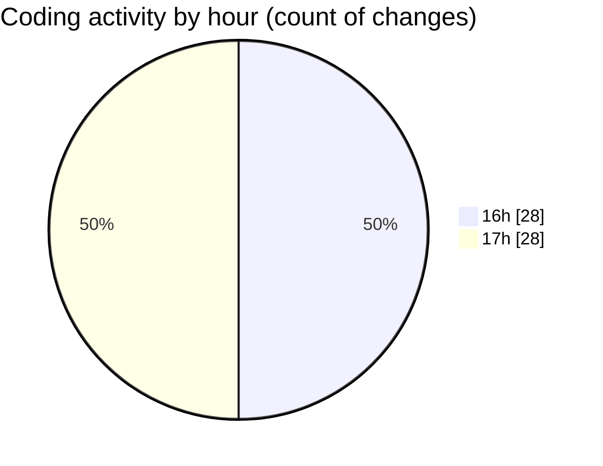

# trackers_app - Activity Summary 

## Overall Statistics

| Stat                   | Value                                                             |
| ---------------------- | ----------------------------------------------------------------- |
| **Lines Added** (➕)   | 1122                                          |
| **Lines Removed** (➖) | 339                                        |
| **Net Change** (↕)    | 783                |
| **Active Time** (⌚)   | 95 minutes |

## Modified Files
- **task.dart** (+88, -3)
- **task_datasource.dart** (+118, -1)
- **heatmap_screen.dart** (+82, -14)
- **my_heatmap.dart** (+209, -158)
- **home_screen.dart** (+156, -1)
- **display_list_of_tasks.dart** (+96, -6)
- **route_location.dart** (+12, -0)
- **app_routes.dart** (+32, -0)
- **modify_task_screen.dart** (+262, -156)
- **helpers.dart** (+67, -0)

## Visualizations

### By File Type (Lines Changed)

### By Hour (Estimated Activity Count)

> **Last Updated:** 1/15/2025, 5:43:03 PM