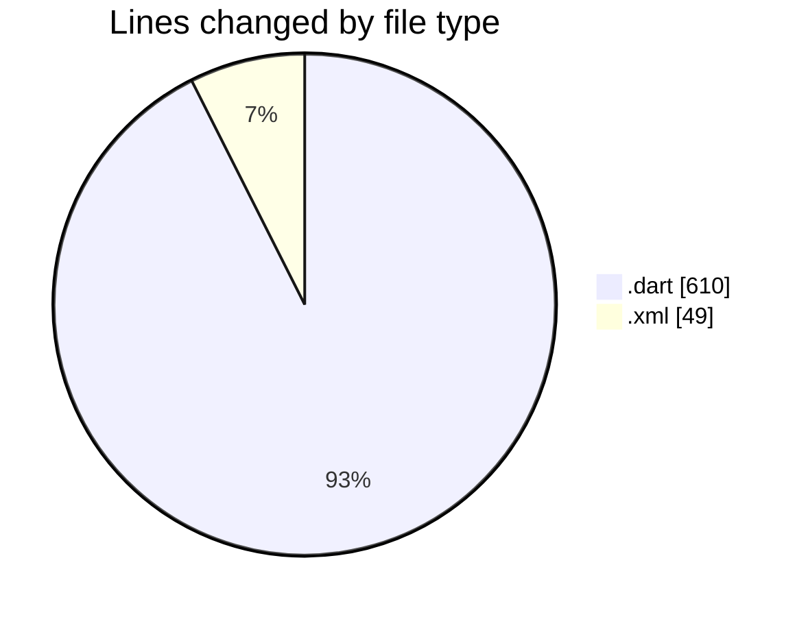
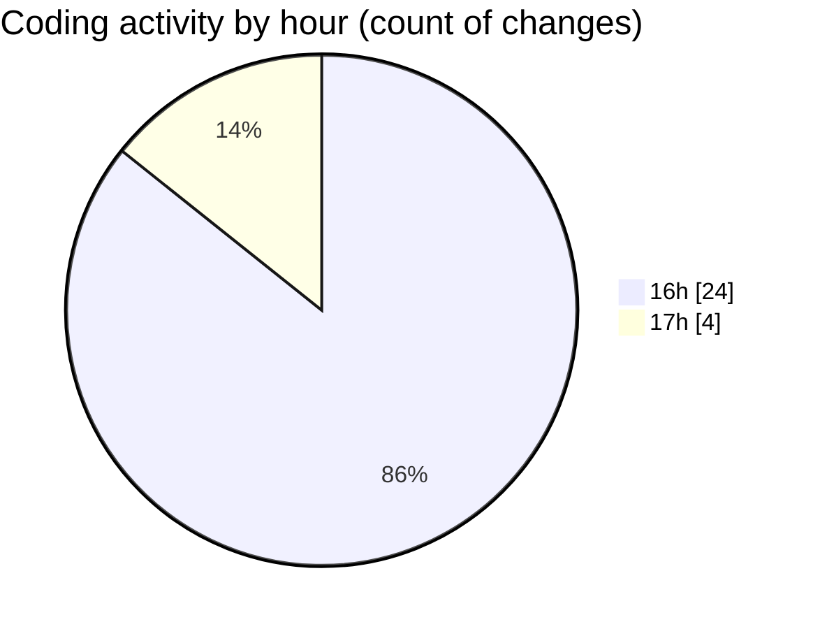

# trackers_app - Activity Summary 

## Overall Statistics

| Stat                   | Value                                                             |
| ---------------------- | ----------------------------------------------------------------- |
| **Lines Added** (➕)   | 611                                          |
| **Lines Removed** (➖) | 48                                        |
| **Net Change** (↕)    | 563                |
| **Active Time** (⌚)   | 52 minutes |

## Modified Files
- **task_notifier.dart** (+66, -13)
- **modify_task_screen.dart** (+125, -1)
- **task_title.dart** (+114, -33)
- **home_screen.dart** (+163, -0)
- **display_list_of_tasks.dart** (+95, -0)
- **AndroidManifest.xml** (+48, -1)

## Visualizations

### By File Type (Lines Changed)

### By Hour (Estimated Activity Count)

> **Last Updated:** 1/26/2025, 5:18:11 PM