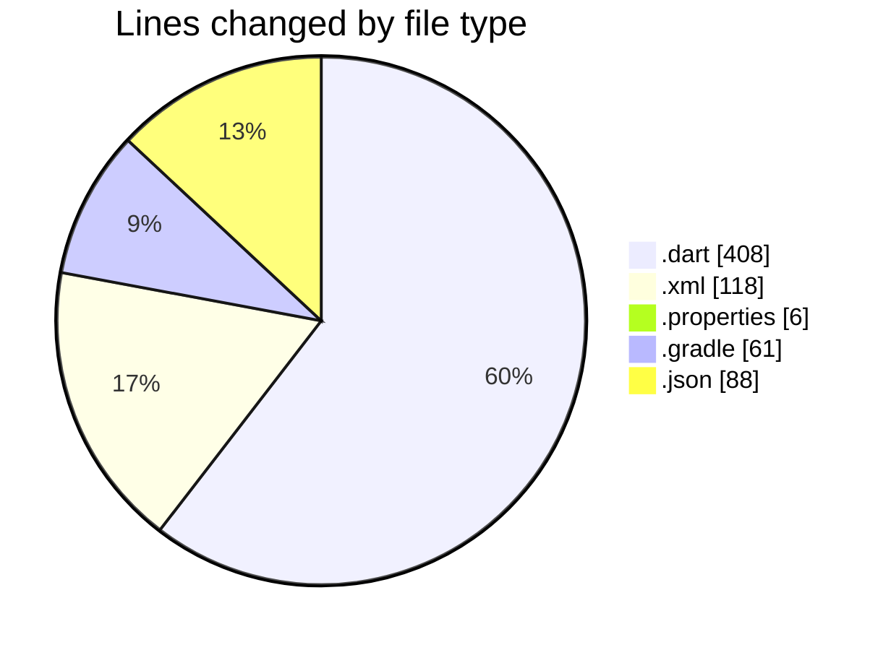
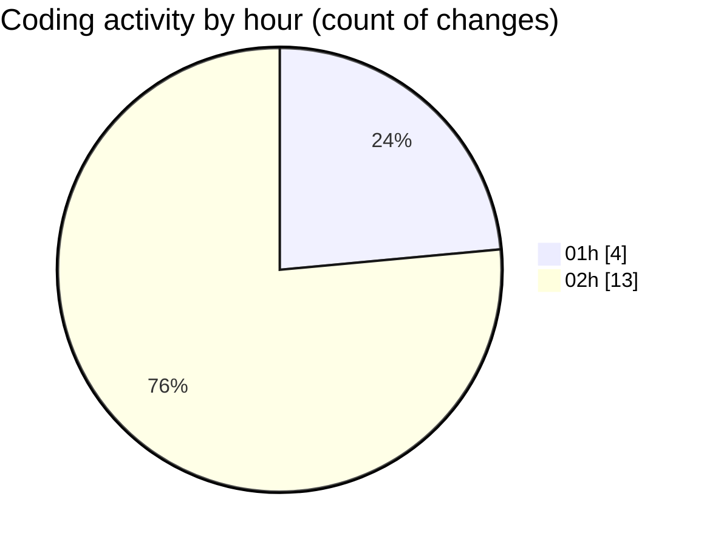

# maps_clone - Activity Summary 

## Overall Statistics

| Stat                   | Value                                                             |
| ---------------------- | ----------------------------------------------------------------- |
| **Lines Added** (➕)   | 678                                          |
| **Lines Removed** (➖) | 3                                        |
| **Net Change** (↕)    | 675                |
| **Active Time** (⌚)   | 27 minutes |

## Modified Files
- **home_screen.dart** (+408, -0)
- **AndroidManifest.xml** (+115, -3)
- **local.properties** (+6, -0)
- **build.gradle** (+61, -0)
- **settings.json** (+88, -0)

## Visualizations

### By File Type (Lines Changed)

### By Hour (Estimated Activity Count)

> **Last Updated:** 1/27/2025, 2:45:11 AM