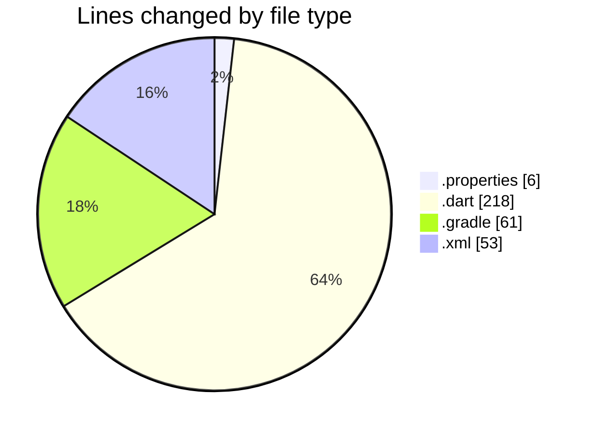
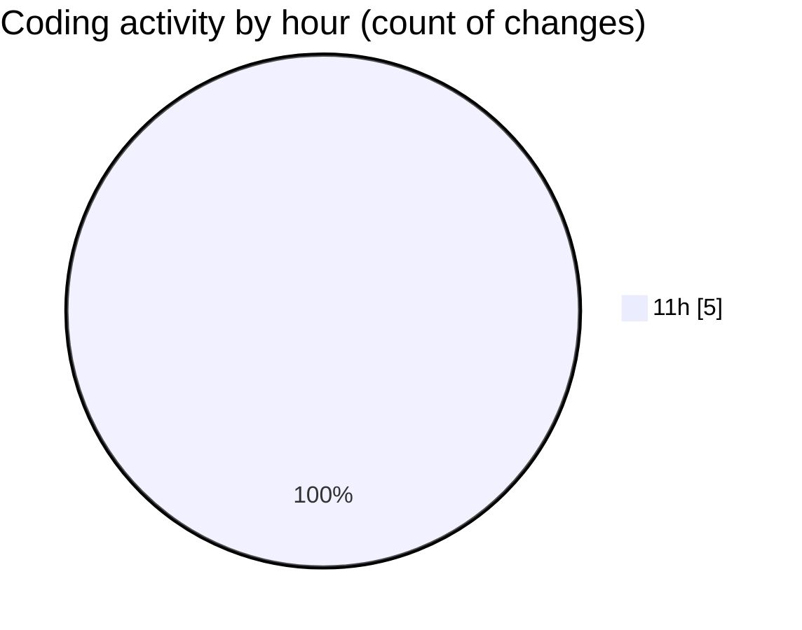

# maps_clone - Activity Summary 

## Overall Statistics

| Stat                   | Value                                                             |
| ---------------------- | ----------------------------------------------------------------- |
| **Lines Added** (➕)   | 324                                          |
| **Lines Removed** (➖) | 14                                        |
| **Net Change** (↕)    | 310                |
| **Active Time** (⌚)   | 3 minutes |

## Modified Files
- **local.properties** (+6, -0)
- **home_screen.dart** (+204, -14)
- **build.gradle** (+61, -0)
- **AndroidManifest.xml** (+53, -0)

## Visualizations

### By File Type (Lines Changed)

### By Hour (Estimated Activity Count)

> **Last Updated:** 1/28/2025, 11:49:19 AM