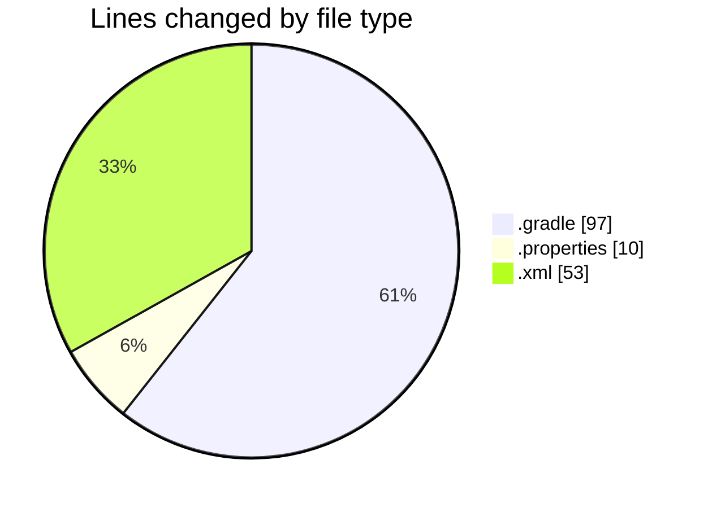
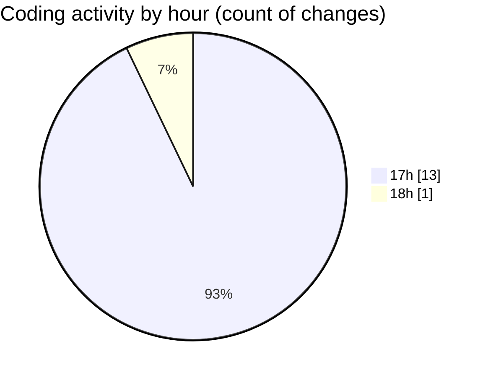

# maps_clone - Activity Summary 

## Overall Statistics

| Stat                   | Value                                                             |
| ---------------------- | ----------------------------------------------------------------- |
| **Lines Added** (➕)   | 159                                          |
| **Lines Removed** (➖) | 1                                        |
| **Net Change** (↕)    | 158                |
| **Active Time** (⌚)   | 13 minutes |

## Modified Files
- **build.gradle** (+66, -0)
- **secrets.properties** (+1, -0)
- **local.properties** (+7, -1)
- **local.defaults.properties** (+1, -0)
- **AndroidManifest.xml** (+53, -0)
- **build.gradle** (+31, -0)

## Visualizations

### By File Type (Lines Changed)

### By Hour (Estimated Activity Count)

> **Last Updated:** 2/1/2025, 6:06:54 PM