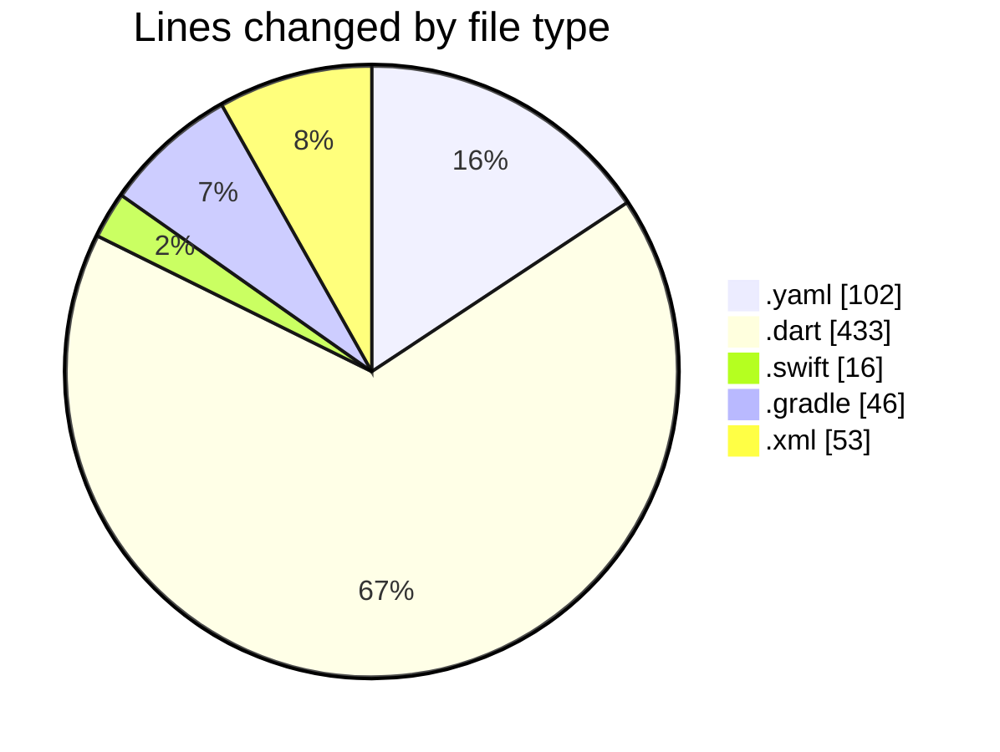
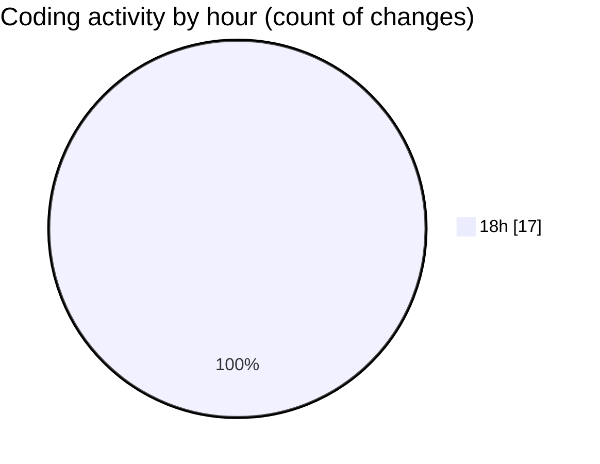

# maps_clone - Activity Summary 

## Overall Statistics

| Stat                   | Value                                                             |
| ---------------------- | ----------------------------------------------------------------- |
| **Lines Added** (➕)   | 442                                          |
| **Lines Removed** (➖) | 208                                        |
| **Net Change** (↕)    | 234                |
| **Active Time** (⌚)   | 17 minutes |

## Modified Files
- **pubspec.yaml** (+98, -4)
- **home_screen.dart** (+190, -188)
- **main.dart** (+39, -16)
- **AppDelegate.swift** (+16, -0)
- **build.gradle** (+46, -0)
- **AndroidManifest.xml** (+53, -0)

## Visualizations

### By File Type (Lines Changed)

### By Hour (Estimated Activity Count)

> **Last Updated:** 2/4/2025, 6:19:32 PM