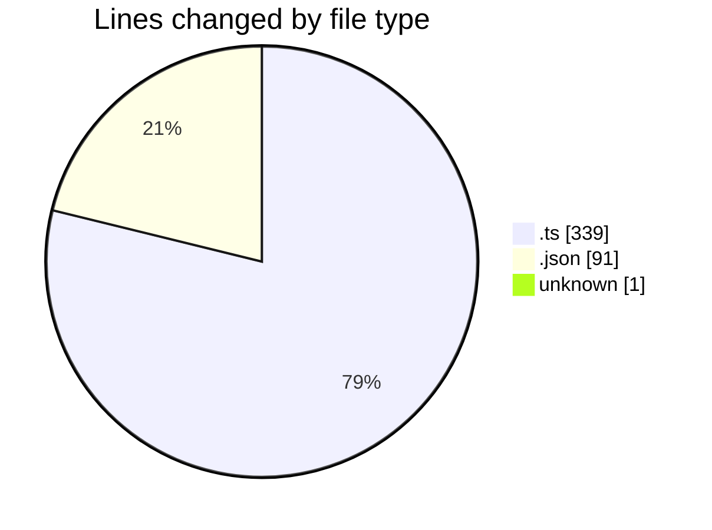
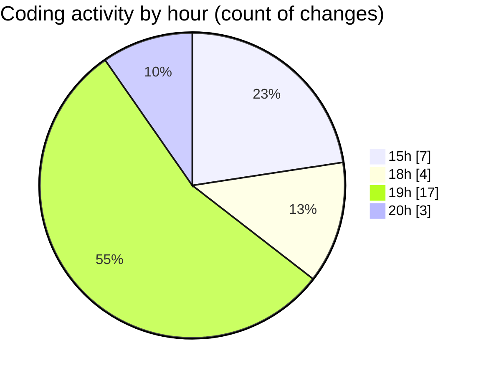

# maps_clone - Activity Summary 

## Overall Statistics

| Stat                   | Value                                                             |
| ---------------------- | ----------------------------------------------------------------- |
| **Lines Added** (➕)   | 391                                          |
| **Lines Removed** (➖) | 40                                        |
| **Net Change** (↕)    | 351                |
| **Active Time** (⌚)   | 40 minutes |

## Modified Files
- **index.ts** (+299, -40)
- **settings.json** (+91, -0)
- **.envs** (+1, -0)

## Visualizations

### By File Type (Lines Changed)

### By Hour (Estimated Activity Count)

> **Last Updated:** 2/8/2025, 8:41:09 PM