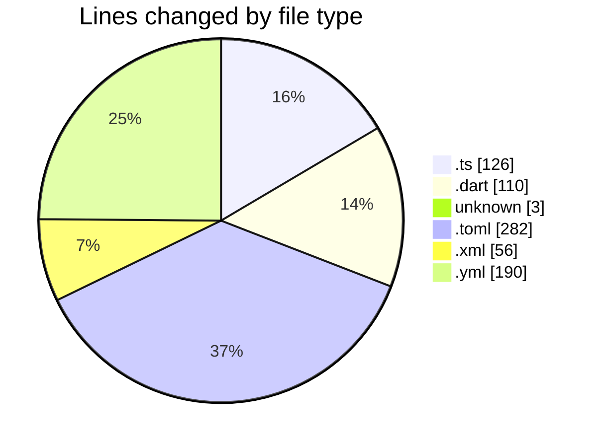
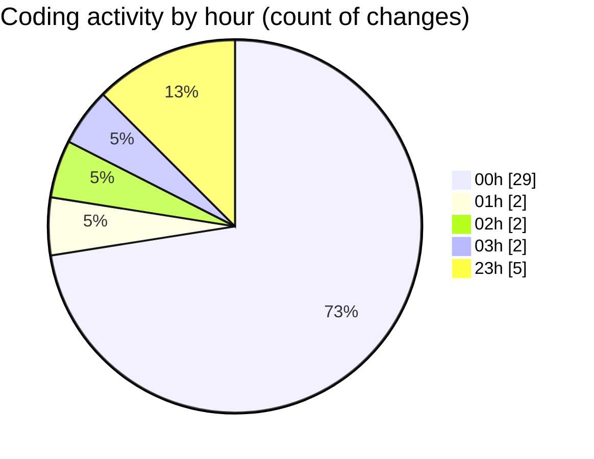

# maps_clone - Activity Summary 

## Overall Statistics

| Stat                   | Value                                                             |
| ---------------------- | ----------------------------------------------------------------- |
| **Lines Added** (➕)   | 711                                          |
| **Lines Removed** (➖) | 56                                        |
| **Net Change** (↕)    | 655                |
| **Active Time** (⌚)   | 46 minutes |

## Modified Files
- **index.ts** (+116, -10)
- **main.dart** (+110, -0)
- **.env** (+1, -0)
- **config.toml** (+282, -0)
- **AndroidManifest.xml** (+56, -0)
- **COMMIT_EDITMSG** (+2, -0)
- **docker-compose.yml** (+144, -46)

## Visualizations

### By File Type (Lines Changed)

### By Hour (Estimated Activity Count)

> **Last Updated:** 2/9/2025, 11:49:21 PM