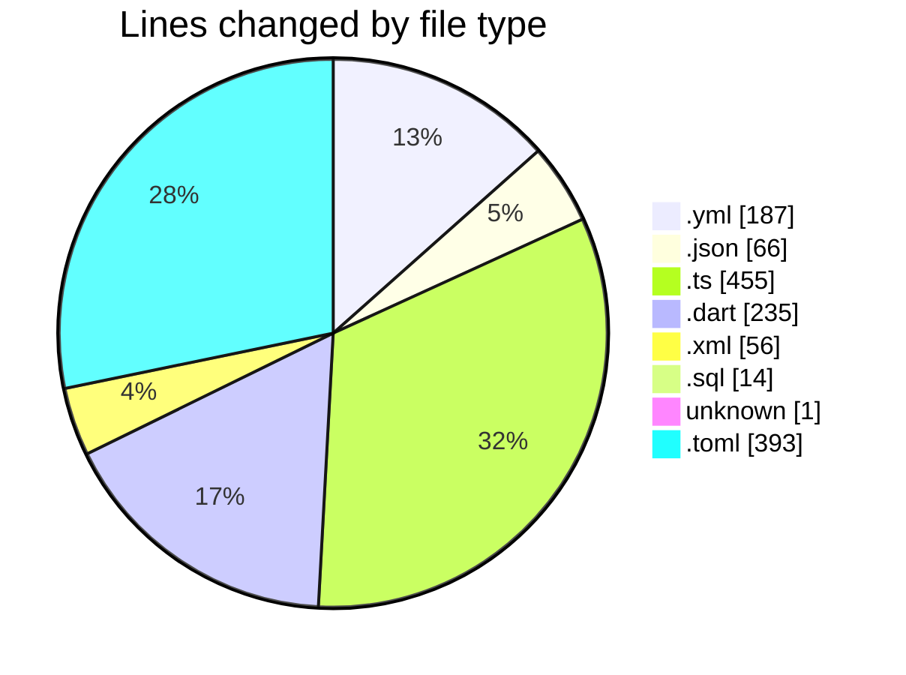
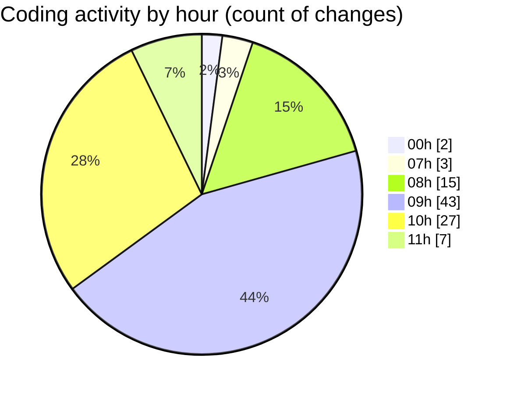

# maps_clone - Activity Summary 

## Overall Statistics

| Stat                   | Value                                                             |
| ---------------------- | ----------------------------------------------------------------- |
| **Lines Added** (➕)   | 1151                                          |
| **Lines Removed** (➖) | 256                                        |
| **Net Change** (↕)    | 895                |
| **Active Time** (⌚)   | 136 minutes |

## Modified Files
- **docker-compose.yml** (+185, -2)
- **deno.json** (+20, -9)
- **import_map.json** (+6, -0)
- **index.ts** (+234, -75)
- **index.ts** (+119, -27)
- **deno.json** (+16, -5)
- **tsconfig.json** (+10, -0)
- **main.dart** (+208, -27)
- **AndroidManifest.xml** (+56, -0)
- **seed.sql** (+14, -0)
- **.env** (+1, -0)
- **config.toml** (+282, -111)

## Visualizations

### By File Type (Lines Changed)

### By Hour (Estimated Activity Count)

> **Last Updated:** 2/10/2025, 11:14:57 AM