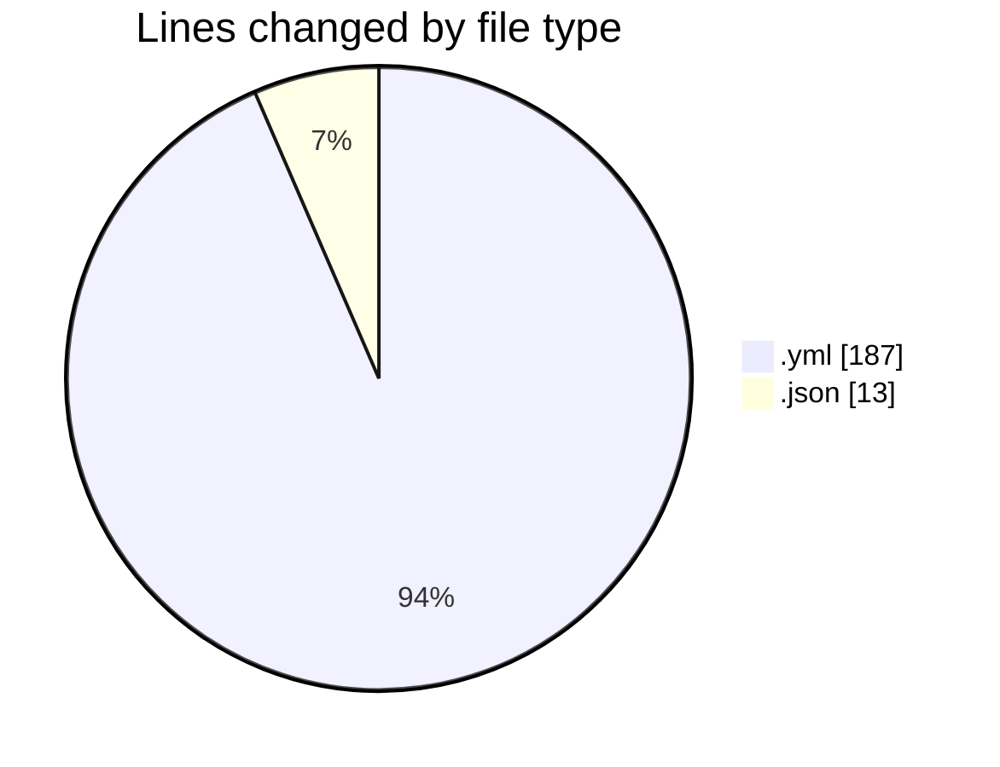
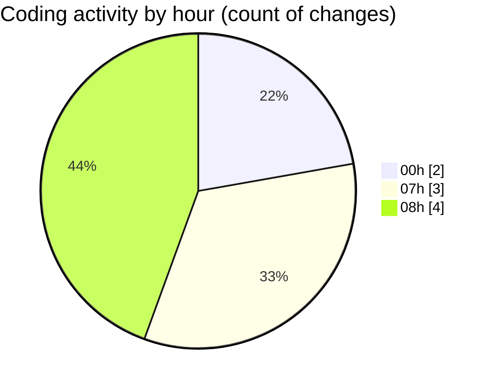

# maps_clone - Activity Summary 

## Overall Statistics

| Stat                   | Value                                                             |
| ---------------------- | ----------------------------------------------------------------- |
| **Lines Added** (➕)   | 198                                          |
| **Lines Removed** (➖) | 2                                        |
| **Net Change** (↕)    | 196                |
| **Active Time** (⌚)   | 8 minutes |

## Modified Files
- **docker-compose.yml** (+185, -2)
- **deno.json** (+7, -0)
- **import_map.json** (+6, -0)

## Visualizations

### By File Type (Lines Changed)

### By Hour (Estimated Activity Count)

> **Last Updated:** 2/10/2025, 8:40:45 AM