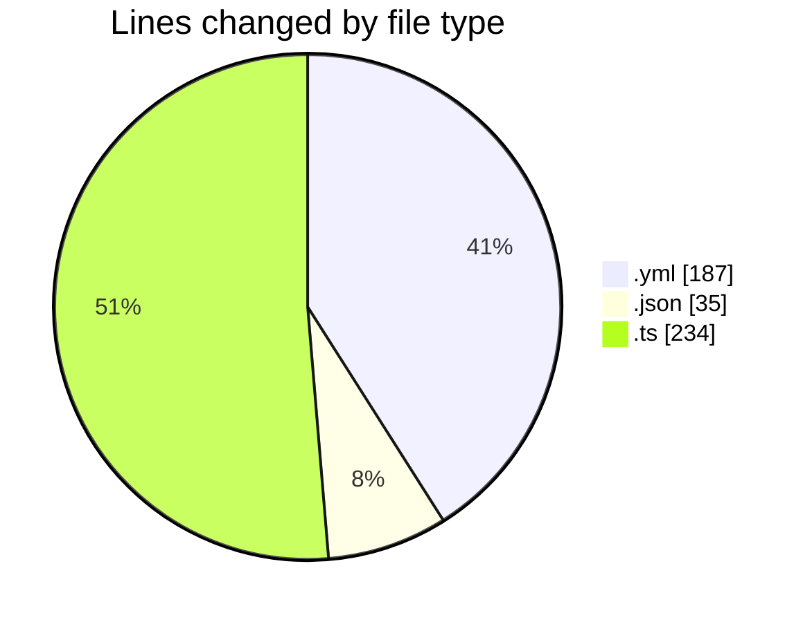
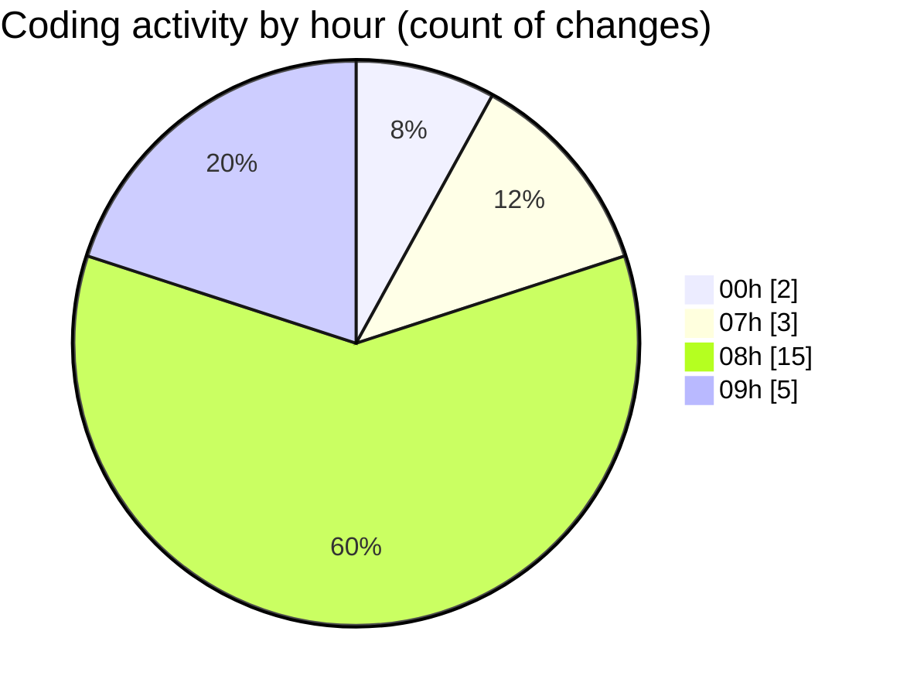

# maps_clone - Activity Summary 

## Overall Statistics

| Stat                   | Value                                                             |
| ---------------------- | ----------------------------------------------------------------- |
| **Lines Added** (➕)   | 431                                          |
| **Lines Removed** (➖) | 25                                        |
| **Net Change** (↕)    | 406                |
| **Active Time** (⌚)   | 31 minutes |

## Modified Files
- **docker-compose.yml** (+185, -2)
- **deno.json** (+20, -9)
- **import_map.json** (+6, -0)
- **index.ts** (+108, -2)
- **index.ts** (+112, -12)

## Visualizations

### By File Type (Lines Changed)

### By Hour (Estimated Activity Count)

> **Last Updated:** 2/10/2025, 9:10:45 AM