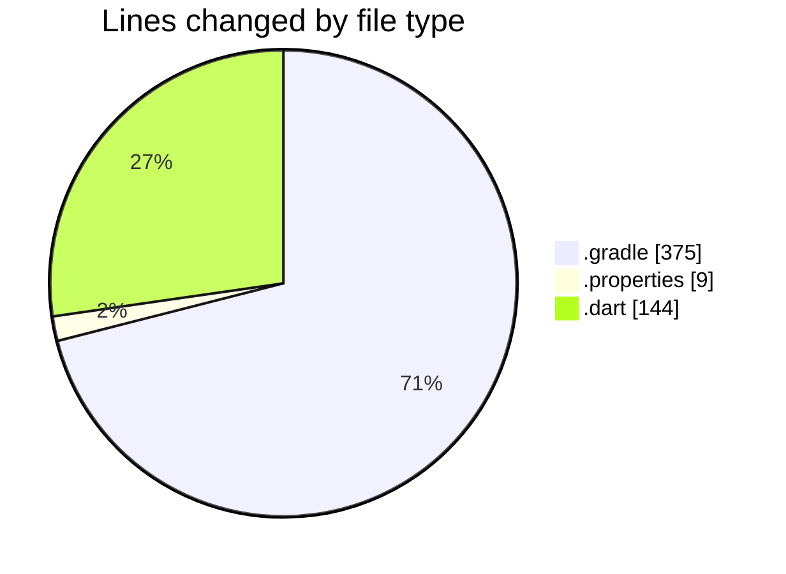
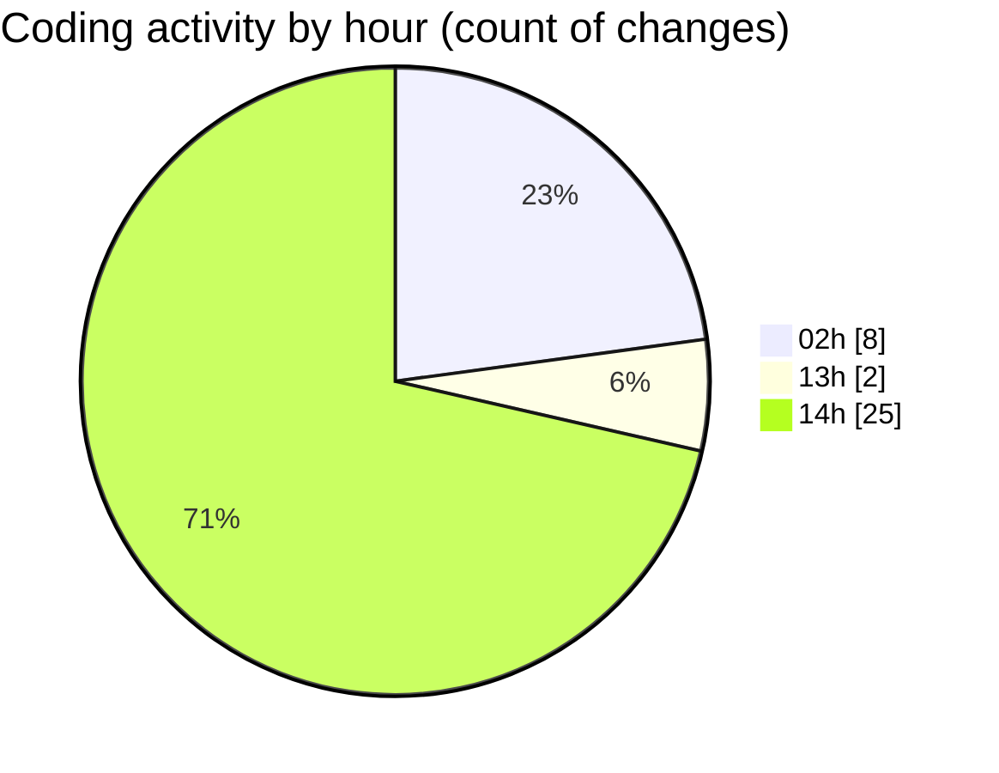

# trackers_app - Activity Summary 

## Overall Statistics

| Stat                   | Value                                                             |
| ---------------------- | ----------------------------------------------------------------- |
| **Lines Added** (➕)   | 446                                          |
| **Lines Removed** (➖) | 82                                        |
| **Net Change** (↕)    | 364                |
| **Active Time** (⌚)   | 61 minutes |

## Modified Files
- **build.gradle** (+124, -17)
- **gradle.properties** (+9, -0)
- **settings.gradle** (+144, -58)
- **helpers.dart** (+142, -2)
- **build.gradle** (+27, -5)

## Visualizations

### By File Type (Lines Changed)

### By Hour (Estimated Activity Count)

> **Last Updated:** 2/16/2025, 2:45:51 PM