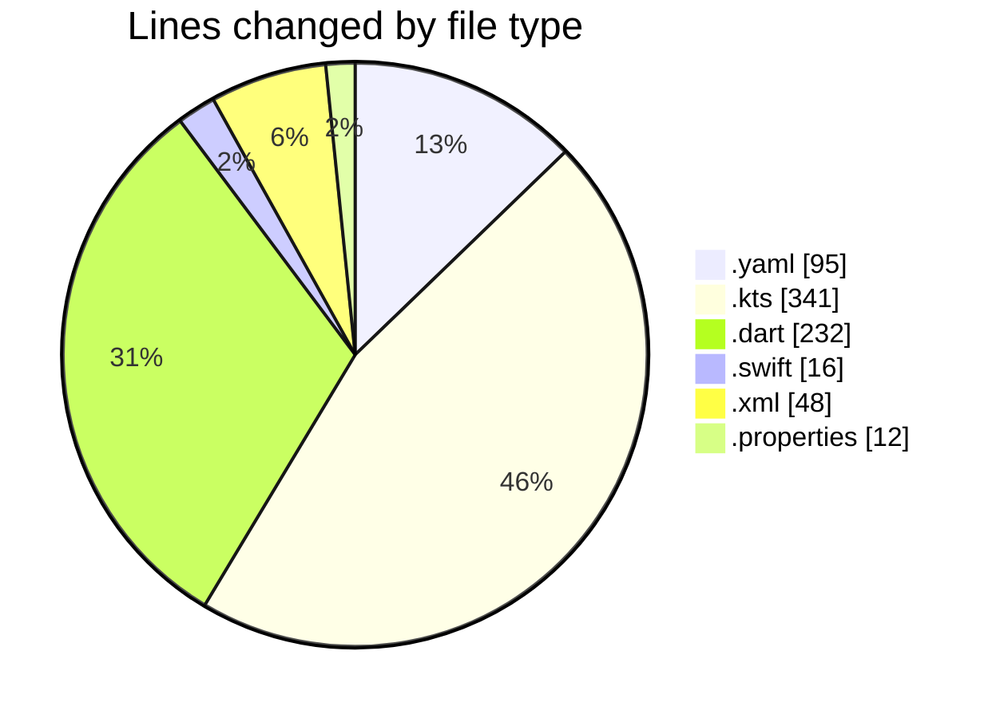
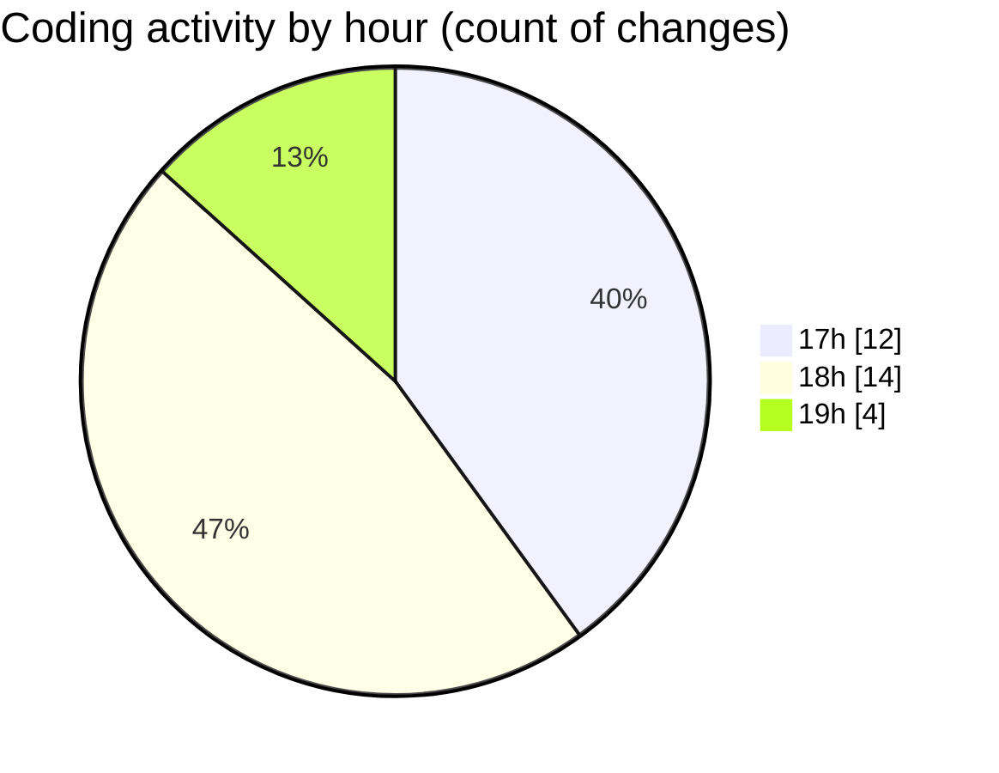

# uber_clone - Activity Summary 

## Overall Statistics

| Stat                   | Value                                                             |
| ---------------------- | ----------------------------------------------------------------- |
| **Lines Added** (➕)   | 607                                          |
| **Lines Removed** (➖) | 137                                        |
| **Net Change** (↕)    | 470                |
| **Active Time** (⌚)   | 41 minutes |

## Modified Files
- **pubspec.yaml** (+95, -0)
- **build.gradle.kts** (+214, -10)
- **main.dart** (+125, -107)
- **AppDelegate.swift** (+16, -0)
- **AndroidManifest.xml** (+48, -0)
- **build.gradle.kts** (+56, -20)
- **gradle-wrapper.properties** (+12, -0)
- **settings.gradle.kts** (+41, -0)

## Visualizations

### By File Type (Lines Changed)

### By Hour (Estimated Activity Count)

> **Last Updated:** 2/16/2025, 7:31:49 PM