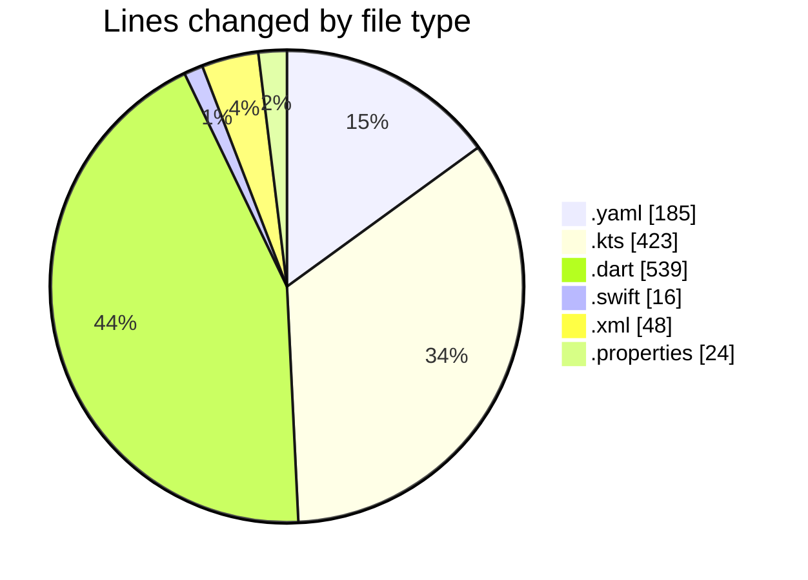
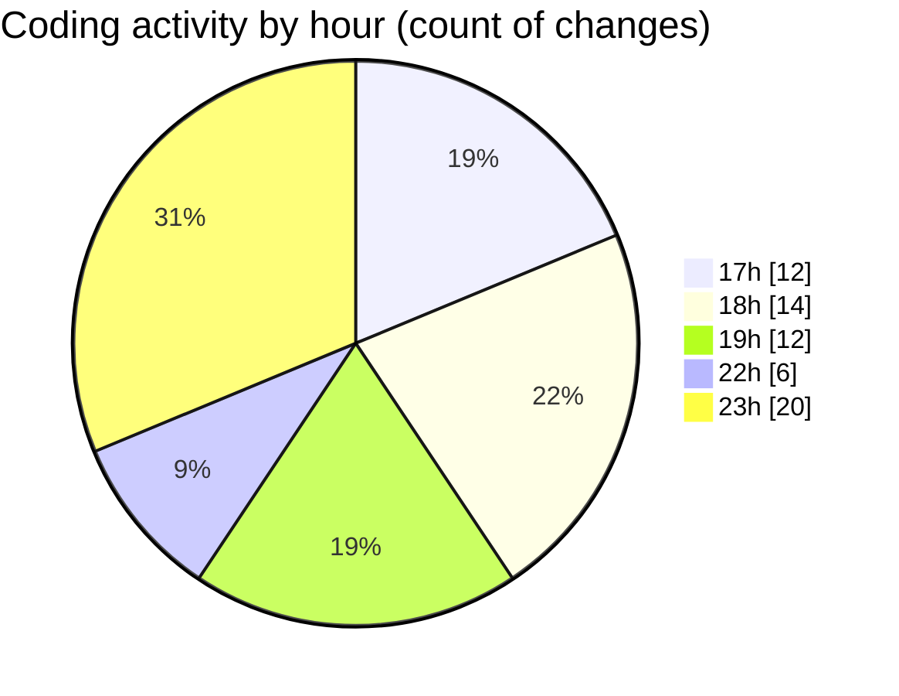

# uber_clone - Activity Summary 

## Overall Statistics

| Stat                   | Value                                                             |
| ---------------------- | ----------------------------------------------------------------- |
| **Lines Added** (➕)   | 962                                          |
| **Lines Removed** (➖) | 273                                        |
| **Net Change** (↕)    | 689                |
| **Active Time** (⌚)   | 83 minutes |

## Modified Files
- **pubspec.yaml** (+185, -0)
- **build.gradle.kts** (+254, -36)
- **main.dart** (+255, -213)
- **AppDelegate.swift** (+16, -0)
- **AndroidManifest.xml** (+48, -0)
- **build.gradle.kts** (+68, -20)
- **gradle-wrapper.properties** (+18, -0)
- **settings.gradle.kts** (+45, -0)
- **gradle.properties** (+6, -0)
- **main_page.dart** (+16, -0)
- **signup_screen.dart** (+35, -4)
- **login_screen.dart** (+16, -0)

## Visualizations

### By File Type (Lines Changed)

### By Hour (Estimated Activity Count)

> **Last Updated:** 2/16/2025, 11:35:41 PM