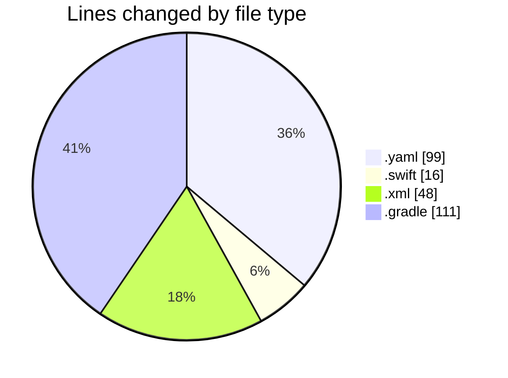
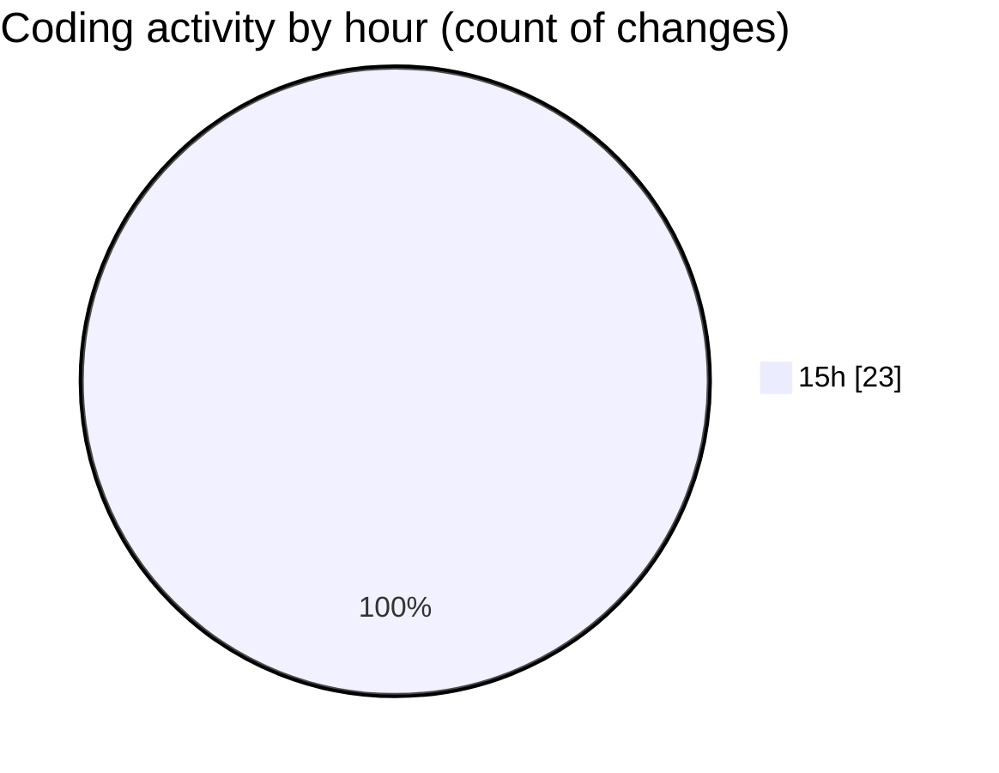

# uber_clone_v1 - Activity Summary 

## Overall Statistics

| Stat                   | Value                                                             |
| ---------------------- | ----------------------------------------------------------------- |
| **Lines Added** (➕)   | 265                                          |
| **Lines Removed** (➖) | 9                                        |
| **Net Change** (↕)    | 256                |
| **Active Time** (⌚)   | 30 minutes |

## Modified Files
- **pubspec.yaml** (+96, -3)
- **AppDelegate.swift** (+16, -0)
- **AndroidManifest.xml** (+48, -0)
- **build.gradle** (+56, -2)
- **settings.gradle** (+26, -0)
- **build.gradle** (+23, -4)

## Visualizations

### By File Type (Lines Changed)

### By Hour (Estimated Activity Count)

> **Last Updated:** 2/16/2025, 3:46:47 PM