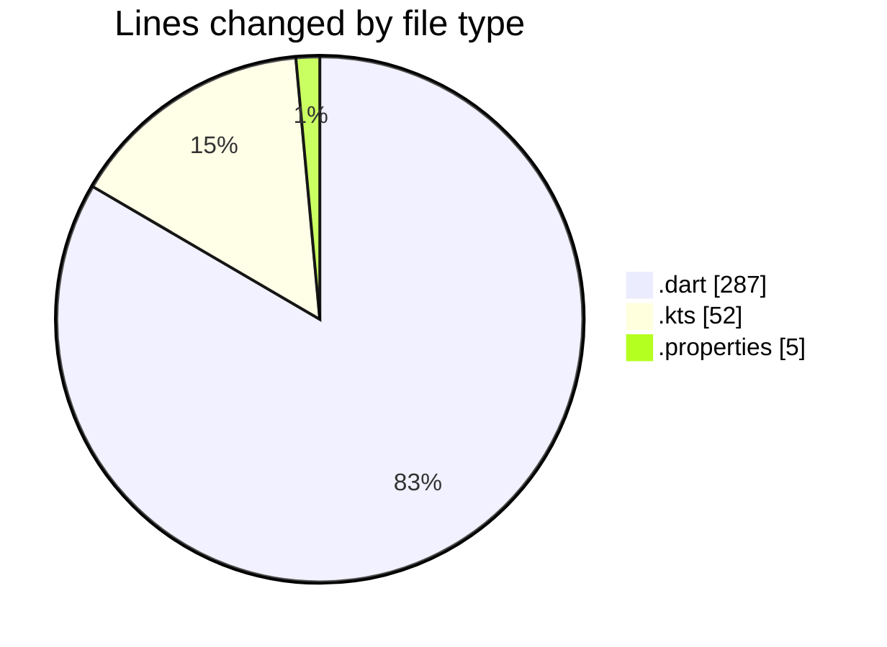
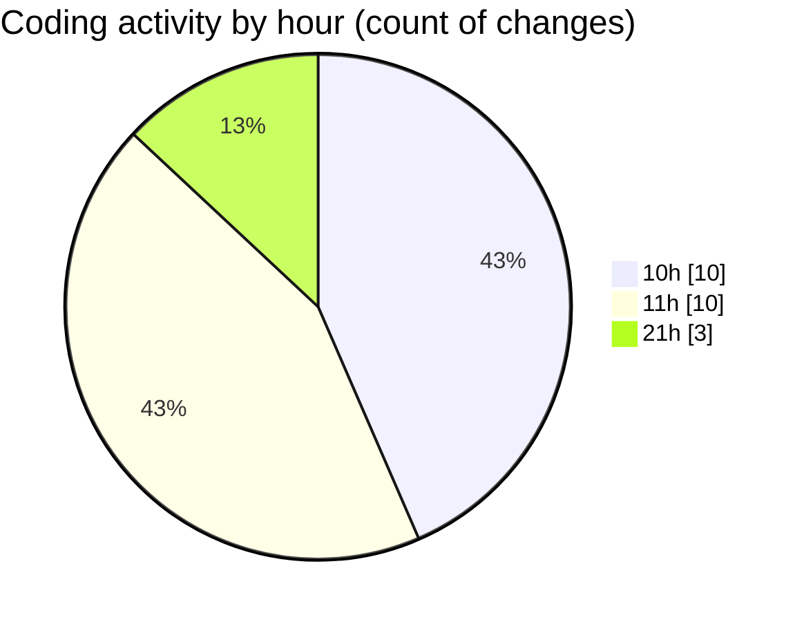

# uber_clone - Activity Summary 

## Overall Statistics

| Stat                   | Value                                                             |
| ---------------------- | ----------------------------------------------------------------- |
| **Lines Added** (➕)   | 334                                          |
| **Lines Removed** (➖) | 10                                        |
| **Net Change** (↕)    | 324                |
| **Active Time** (⌚)   | 44 minutes |

## Modified Files
- **signup_screen.dart** (+257, -0)
- **common_methods.dart** (+27, -3)
- **build.gradle.kts** (+45, -7)
- **local.properties** (+5, -0)

## Visualizations

### By File Type (Lines Changed)

### By Hour (Estimated Activity Count)

> **Last Updated:** 2/18/2025, 9:40:21 PM