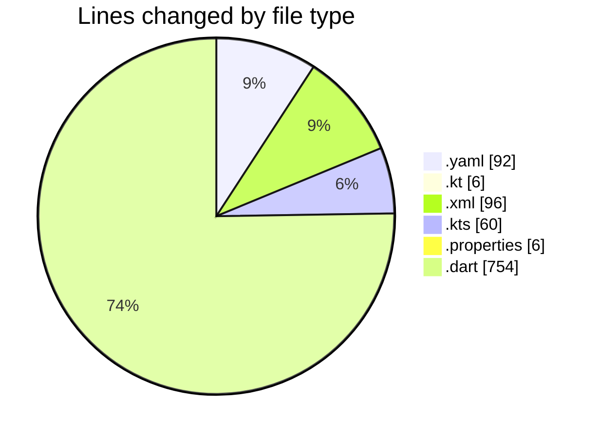
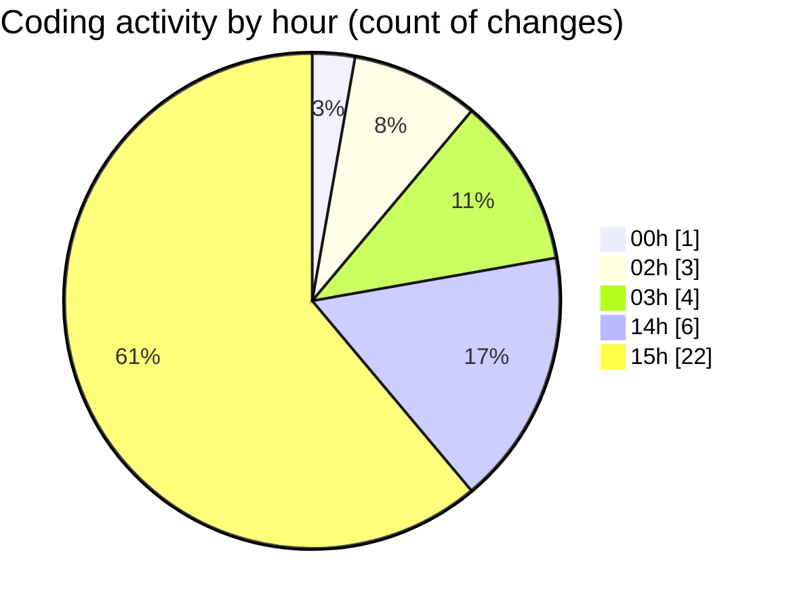

# uber_clone - Activity Summary 

## Overall Statistics

| Stat                   | Value                                                             |
| ---------------------- | ----------------------------------------------------------------- |
| **Lines Added** (➕)   | 992                                          |
| **Lines Removed** (➖) | 22                                        |
| **Net Change** (↕)    | 970                |
| **Active Time** (⌚)   | 52 minutes |

## Modified Files
- **pubspec.yaml** (+92, -0)
- **MainActivity.kt** (+6, -0)
- **AndroidManifest.xml** (+95, -1)
- **build.gradle.kts** (+60, -0)
- **gradle.properties** (+6, -0)
- **login_screen.dart** (+306, -1)
- **signup_screen.dart** (+322, -5)
- **loading_dialog.dart** (+46, -5)
- **global_var.dart** (+13, -0)
- **home_screen.dart** (+46, -10)

## Visualizations

### By File Type (Lines Changed)

### By Hour (Estimated Activity Count)

> **Last Updated:** 2/19/2025, 3:33:29 PM