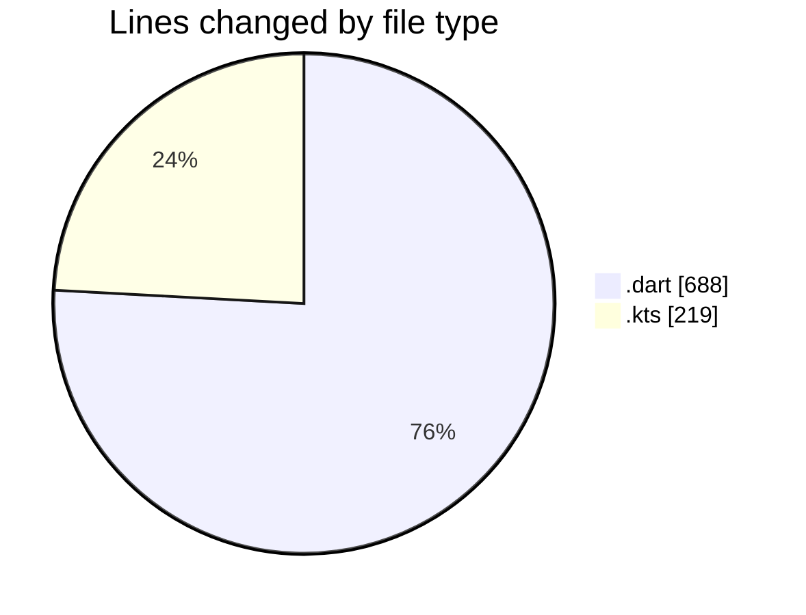
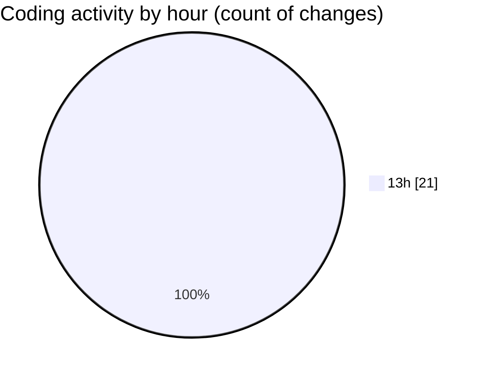

# drivers_app - Activity Summary 

## Overall Statistics

| Stat                   | Value                                                             |
| ---------------------- | ----------------------------------------------------------------- |
| **Lines Added** (➕)   | 847                                          |
| **Lines Removed** (➖) | 60                                        |
| **Net Change** (↕)    | 787                |
| **Active Time** (⌚)   | 33 minutes |

## Modified Files
- **login_screen.dart** (+306, -2)
- **signup_screen.dart** (+340, -5)
- **build.gradle.kts** (+104, -53)
- **build.gradle.kts** (+36, -0)
- **settings.gradle.kts** (+26, -0)
- **main.dart** (+35, -0)

## Visualizations

### By File Type (Lines Changed)

### By Hour (Estimated Activity Count)

> **Last Updated:** 2/24/2025, 1:56:34 PM