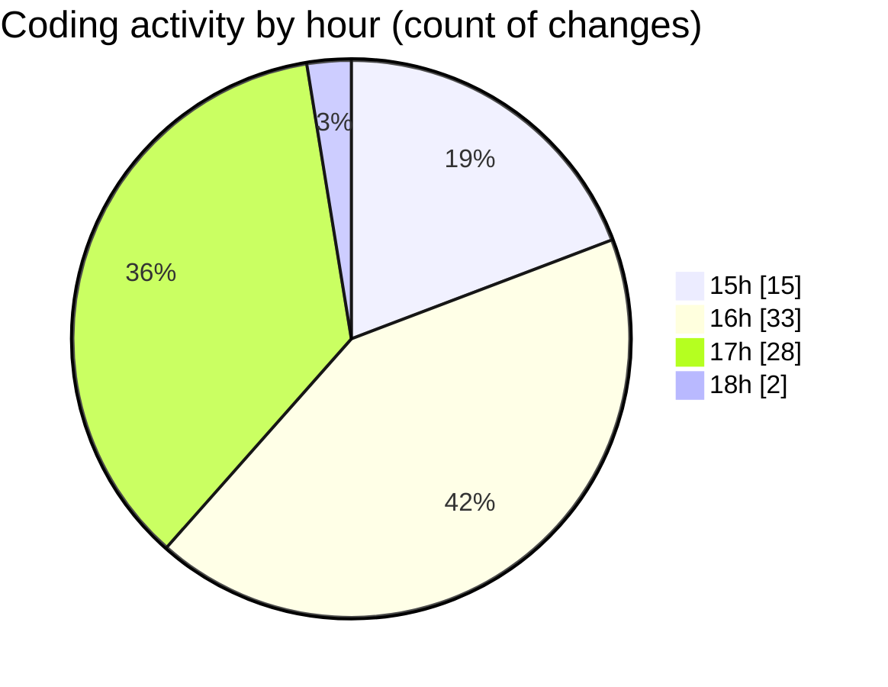

# trackers_app - Activity Summary 

## Overall Statistics

| Stat                   | Value                                                             |
| ---------------------- | ----------------------------------------------------------------- |
| **Lines Added** (➕)   | 1274                                          |
| **Lines Removed** (➖) | 371                                        |
| **Net Change** (↕)    | 903                |
| **Active Time** (⌚)   | 128 minutes |

## Modified Files
- **home_screen.dart** (+252, -7)
- **my_heatmap.dart** (+345, -254)
- **heatmap_screen.dart** (+108, -40)
- **app_routes.dart** (+34, -2)
- **HeatmapPage.dart** (+130, -65)
- **pubspec.yaml** (+103, -0)
- **helpers.dart** (+77, -0)
- **task_notifier.dart** (+56, -0)
- **task_repository_impl.dart** (+50, -0)
- **task_datasource.dart** (+119, -3)

## Visualizations

### By File Type (Lines Changed)

### By Hour (Estimated Activity Count)

> **Last Updated:** 2/25/2025, 6:01:55 PM