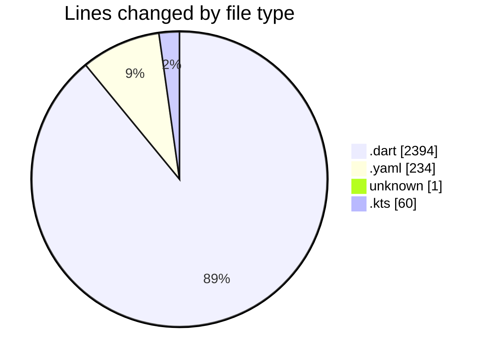
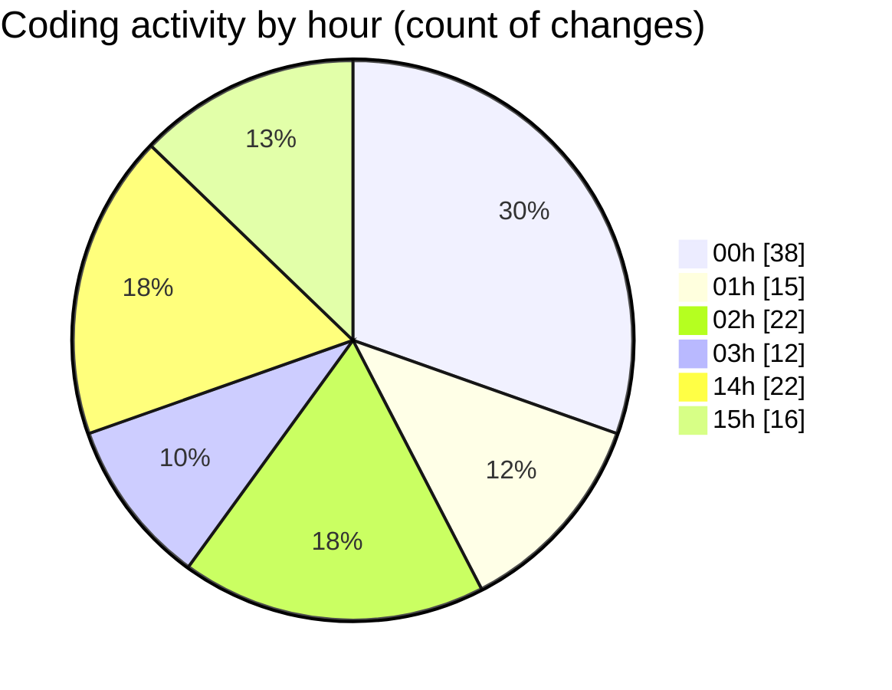

# uber_clone - Activity Summary 

## Overall Statistics

| Stat                   | Value                                                             |
| ---------------------- | ----------------------------------------------------------------- |
| **Lines Added** (➕)   | 1912                                          |
| **Lines Removed** (➖) | 777                                        |
| **Net Change** (↕)    | 1135                |
| **Active Time** (⌚)   | 186 minutes |

## Modified Files
- **home_screen.dart** (+451, -3)
- **search_destination.dart** (+1055, -676)
- **pubspec.yaml** (+221, -13)
- **main.dart** (+124, -85)
- **.env** (+1, -0)
- **build.gradle.kts** (+60, -0)

## Visualizations

### By File Type (Lines Changed)

### By Hour (Estimated Activity Count)

> **Last Updated:** 3/8/2025, 3:34:46 PM