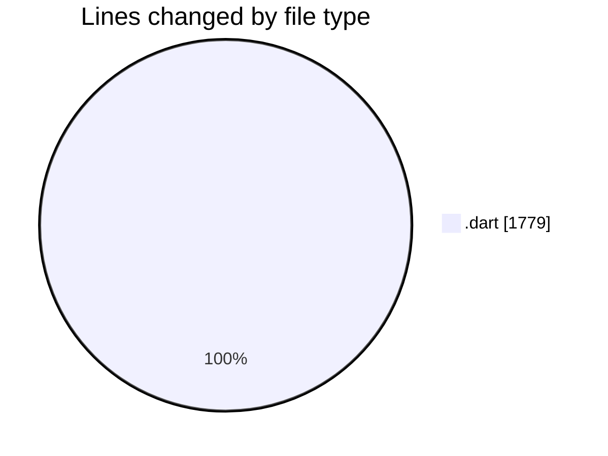
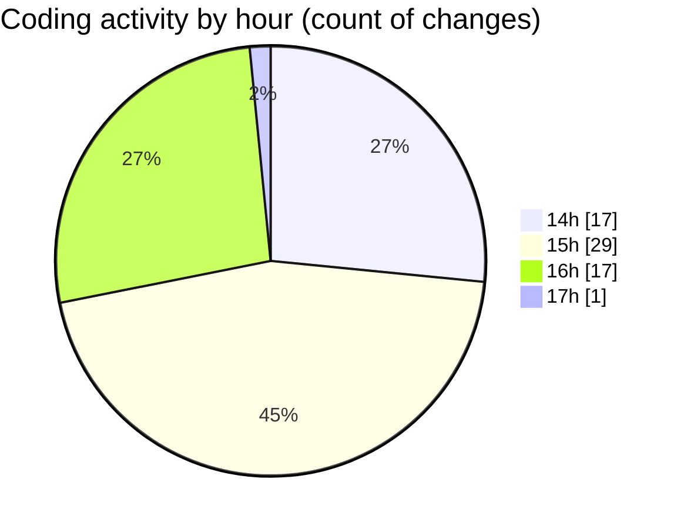

# trackers_app - Activity Summary 

## Overall Statistics

| Stat                   | Value                                                             |
| ---------------------- | ----------------------------------------------------------------- |
| **Lines Added** (➕)   | 1555                                          |
| **Lines Removed** (➖) | 224                                        |
| **Net Change** (↕)    | 1331                |
| **Active Time** (⌚)   | 70 minutes |

## Modified Files
- **light_mode.dart** (+15, -0)
- **dark_mode.dart** (+15, -0)
- **app_theme.dart** (+43, -25)
- **theme.dart** (+6, -1)
- **theme_provider.dart** (+46, -0)
- **main.dart** (+51, -38)
- **trackers_app.dart** (+36, -0)
- **home_screen.dart** (+336, -36)
- **task_repositories.dart** (+10, -0)
- **task_repository_impl.dart** (+129, -15)
- **heatmap_provider.dart** (+21, -0)
- **task_notifier.dart** (+124, -31)
- **task_state.dart** (+49, -2)
- **my_heatmap.dart** (+132, -4)
- **heatmap_screen.dart** (+82, -0)
- **display_list_of_tasks.dart** (+204, -58)
- **datasource_exception.dart** (+11, -0)
- **repository_exception.dart** (+11, -0)
- **task_datasource.dart** (+234, -14)

## Visualizations

### By File Type (Lines Changed)

### By Hour (Estimated Activity Count)

> **Last Updated:** 4/10/2025, 5:24:49 PM