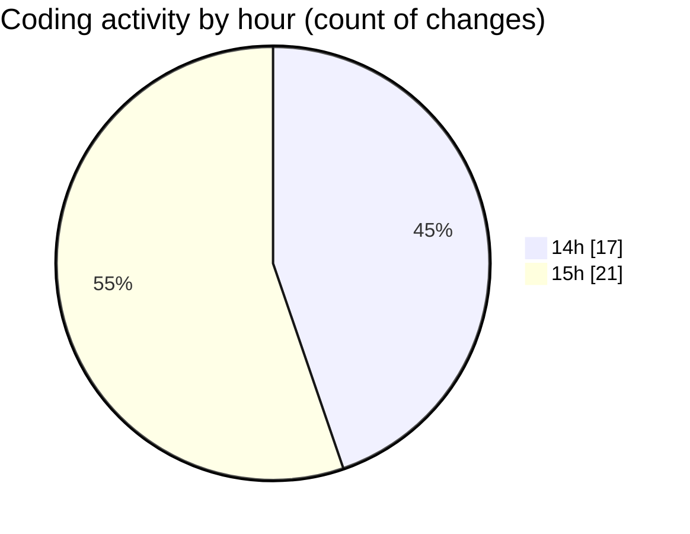

# trackers_app - Activity Summary 

## Overall Statistics

| Stat                   | Value                                                             |
| ---------------------- | ----------------------------------------------------------------- |
| **Lines Added** (➕)   | 944                                          |
| **Lines Removed** (➖) | 81                                        |
| **Net Change** (↕)    | 863                |
| **Active Time** (⌚)   | 45 minutes |

## Modified Files
- **light_mode.dart** (+15, -0)
- **dark_mode.dart** (+15, -0)
- **app_theme.dart** (+43, -25)
- **theme.dart** (+6, -1)
- **theme_provider.dart** (+46, -0)
- **main.dart** (+51, -38)
- **trackers_app.dart** (+36, -0)
- **home_screen.dart** (+325, -0)
- **task_repositories.dart** (+10, -0)
- **task_repository_impl.dart** (+50, -15)
- **heatmap_provider.dart** (+21, -0)
- **task_notifier.dart** (+97, -0)
- **task_state.dart** (+25, -2)
- **my_heatmap.dart** (+124, -0)
- **heatmap_screen.dart** (+80, -0)

## Visualizations

### By File Type (Lines Changed)

### By Hour (Estimated Activity Count)

> **Last Updated:** 4/10/2025, 3:34:49 PM