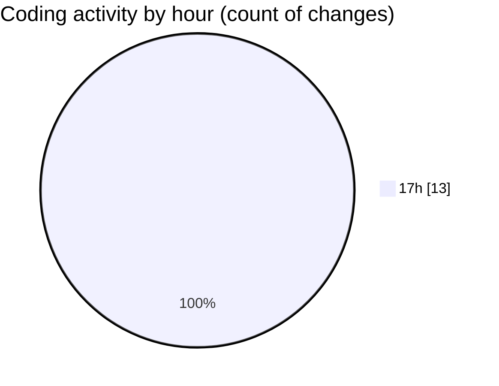

# projet_rmi - Activity Summary 

## Overall Statistics

| Stat                   | Value                                                             |
| ---------------------- | ----------------------------------------------------------------- |
| **Lines Added** (➕)   | 142                                          |
| **Lines Removed** (➖) | 18                                        |
| **Net Change** (↕)    | 124                |
| **Active Time** (⌚)   | 14 minutes |

## Modified Files
- **BanqueService.java** (+29, -18)
- **BanqueServiceImpl.java** (+59, -0)
- **Serveur.java** (+18, -0)
- **Client.java** (+36, -0)

## Visualizations

### By File Type (Lines Changed)

### By Hour (Estimated Activity Count)

> **Last Updated:** 10/4/2025, 5:51:30 PM