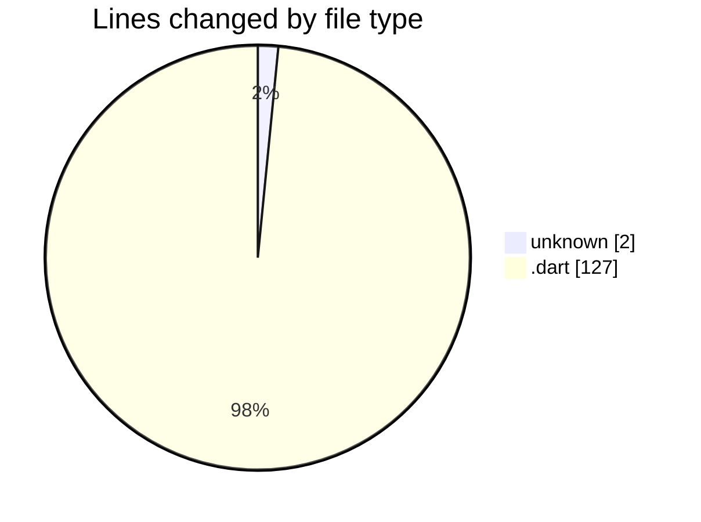
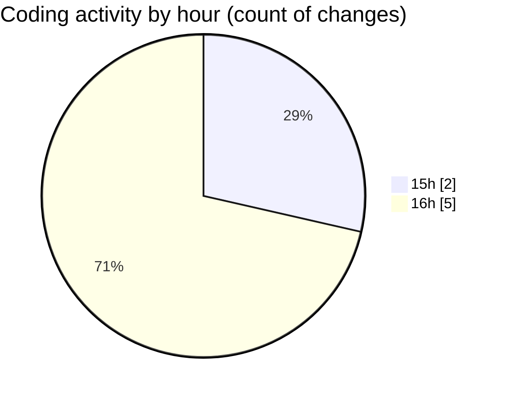

# weather_insights_app - Activity Summary 

## Overall Statistics

| Stat                   | Value                                                             |
| ---------------------- | ----------------------------------------------------------------- |
| **Lines Added** (➕)   | 129                                          |
| **Lines Removed** (➖) | 0                                        |
| **Net Change** (↕)    | 129                |
| **Active Time** (⌚)   | 11 minutes |

## Modified Files
- **.env** (+2, -0)
- **weather_service.dart** (+1, -0)
- **weather_model.dart** (+1, -0)
- **home_screen.dart** (+1, -0)
- **weather_chart.dart** (+1, -0)
- **main.dart** (+123, -0)

## Visualizations

### By File Type (Lines Changed)

### By Hour (Estimated Activity Count)

> **Last Updated:** 10/19/2025, 4:06:50 PM