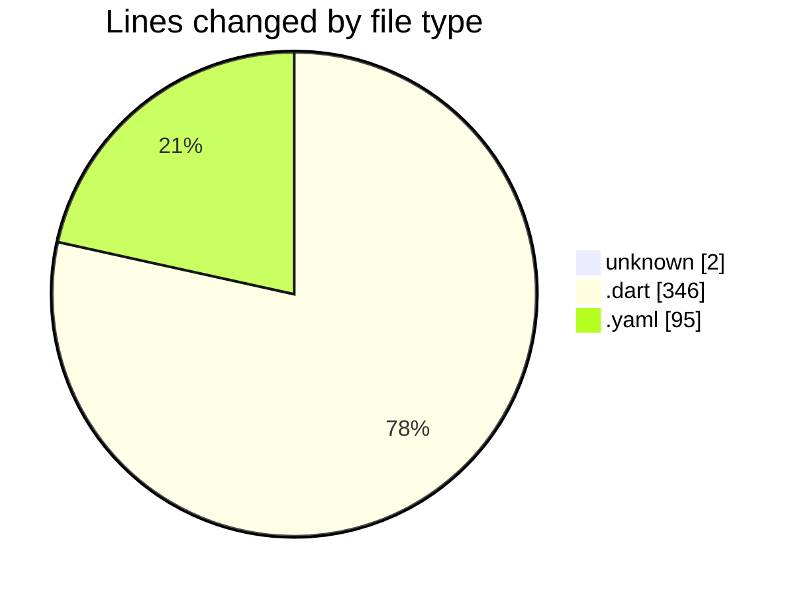
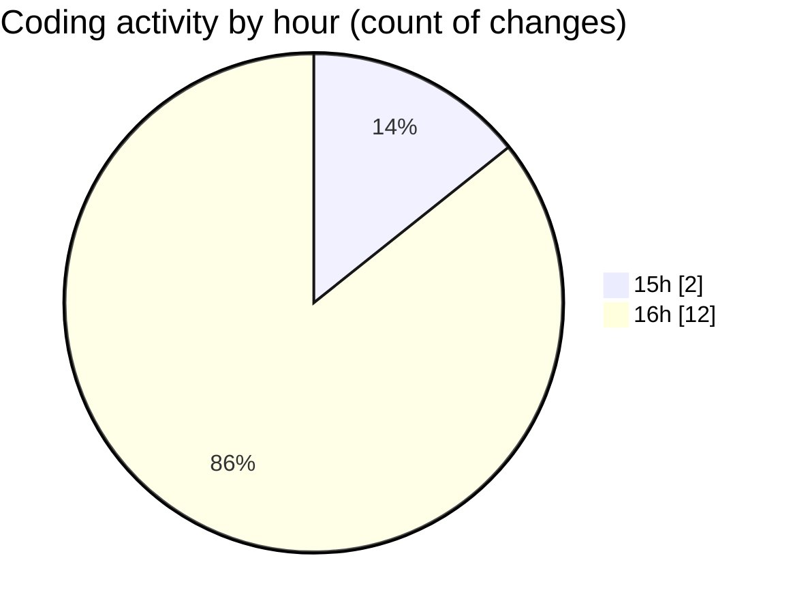

# weather_insights_app - Activity Summary 

## Overall Statistics

| Stat                   | Value                                                             |
| ---------------------- | ----------------------------------------------------------------- |
| **Lines Added** (➕)   | 350                                          |
| **Lines Removed** (➖) | 93                                        |
| **Net Change** (↕)    | 257                |
| **Active Time** (⌚)   | 30 minutes |

## Modified Files
- **.env** (+2, -0)
- **weather_service.dart** (+19, -0)
- **weather_model.dart** (+23, -0)
- **home_screen.dart** (+58, -0)
- **weather_chart.dart** (+30, -0)
- **main.dart** (+123, -93)
- **pubspec.yaml** (+95, -0)

## Visualizations

### By File Type (Lines Changed)

### By Hour (Estimated Activity Count)

> **Last Updated:** 10/19/2025, 4:11:50 PM