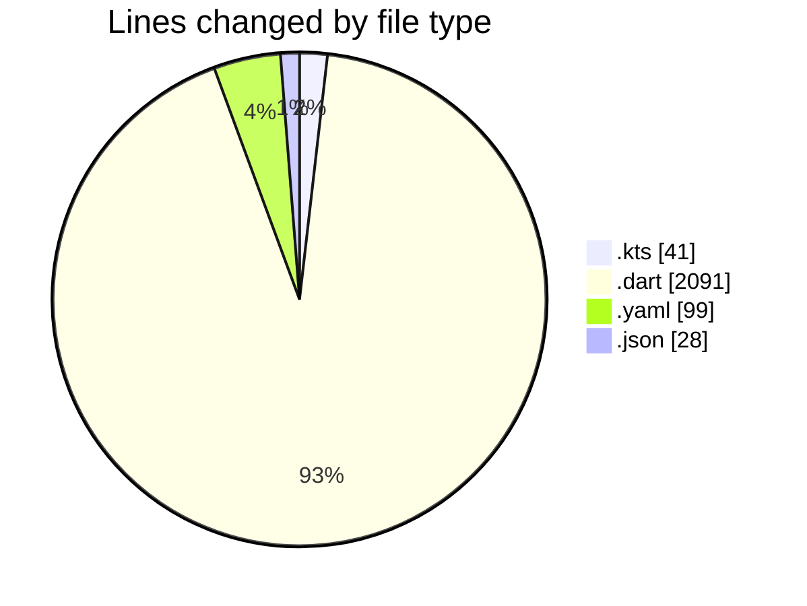
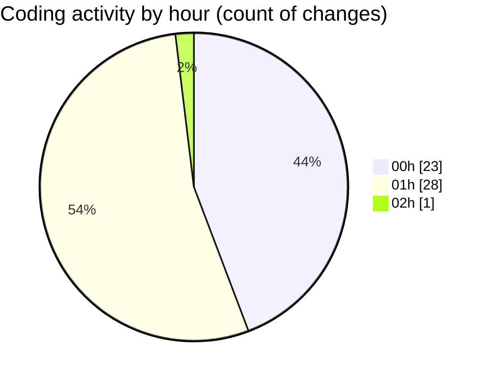

# weather_insights_app - Activity Summary 

## Overall Statistics

| Stat                   | Value                                                             |
| ---------------------- | ----------------------------------------------------------------- |
| **Lines Added** (➕)   | 1837                                          |
| **Lines Removed** (➖) | 422                                        |
| **Net Change** (↕)    | 1415                |
| **Active Time** (⌚)   | 86 minutes |

## Modified Files
- **build.gradle.kts** (+41, -0)
- **home_screen.dart** (+1361, -403)
- **weather_service.dart** (+60, -16)
- **pubspec.yaml** (+97, -2)
- **weather_model.dart** (+140, -0)
- **weather-welcome.json** (+1, -0)
- **weather_chart.dart** (+30, -1)
- **settings.json** (+27, -0)
- **animated_weather_card.dart** (+80, -0)

## Visualizations

### By File Type (Lines Changed)

### By Hour (Estimated Activity Count)

> **Last Updated:** 10/20/2025, 2:14:23 AM