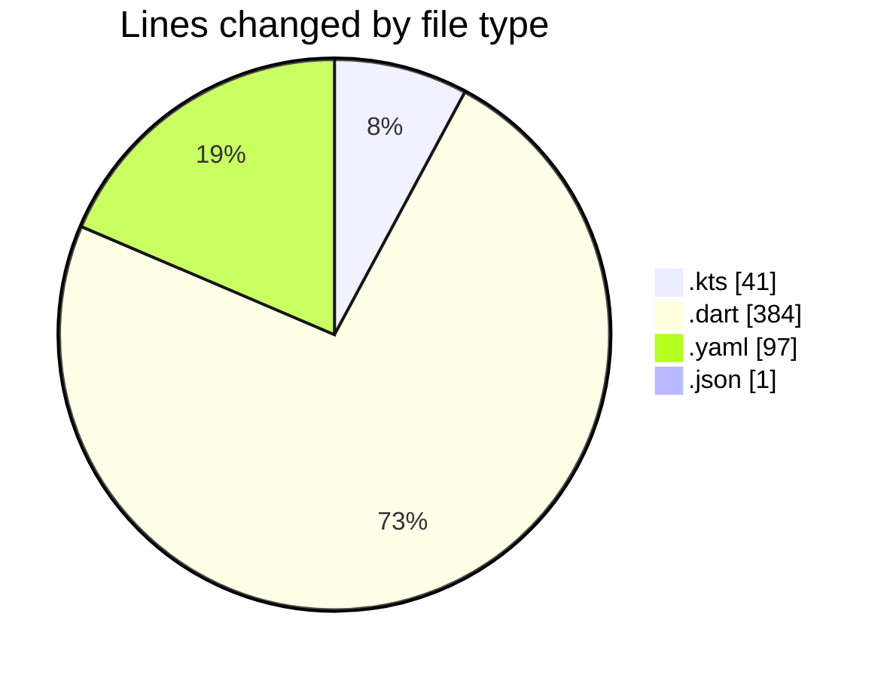
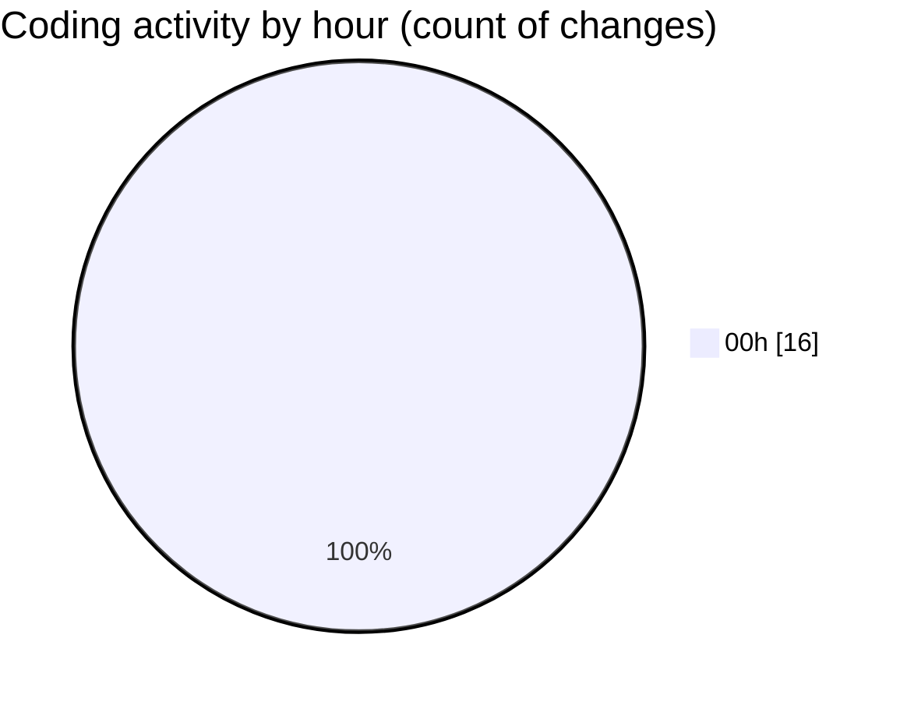

# weather_insights_app - Activity Summary 

## Overall Statistics

| Stat                   | Value                                                             |
| ---------------------- | ----------------------------------------------------------------- |
| **Lines Added** (➕)   | 507                                          |
| **Lines Removed** (➖) | 16                                        |
| **Net Change** (↕)    | 491                |
| **Active Time** (⌚)   | 28 minutes |

## Modified Files
- **build.gradle.kts** (+41, -0)
- **home_screen.dart** (+239, -0)
- **weather_service.dart** (+60, -16)
- **pubspec.yaml** (+97, -0)
- **weather_model.dart** (+69, -0)
- **weather-welcome.json** (+1, -0)

## Visualizations

### By File Type (Lines Changed)

### By Hour (Estimated Activity Count)

> **Last Updated:** 10/20/2025, 12:39:23 AM