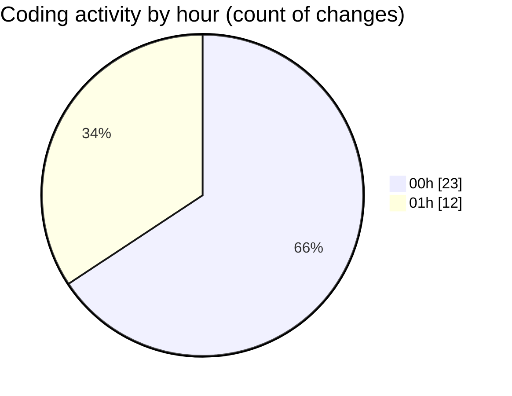

# weather_insights_app - Activity Summary 

## Overall Statistics

| Stat                   | Value                                                             |
| ---------------------- | ----------------------------------------------------------------- |
| **Lines Added** (➕)   | 888                                          |
| **Lines Removed** (➖) | 83                                        |
| **Net Change** (↕)    | 805                |
| **Active Time** (⌚)   | 65 minutes |

## Modified Files
- **build.gradle.kts** (+41, -0)
- **home_screen.dart** (+519, -64)
- **weather_service.dart** (+60, -16)
- **pubspec.yaml** (+97, -2)
- **weather_model.dart** (+140, -0)
- **weather-welcome.json** (+1, -0)
- **weather_chart.dart** (+30, -1)

## Visualizations

### By File Type (Lines Changed)

### By Hour (Estimated Activity Count)

> **Last Updated:** 10/20/2025, 1:24:23 AM