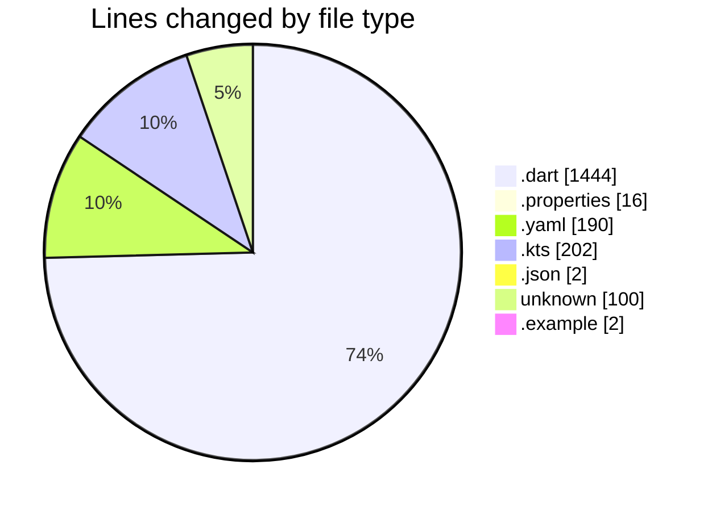
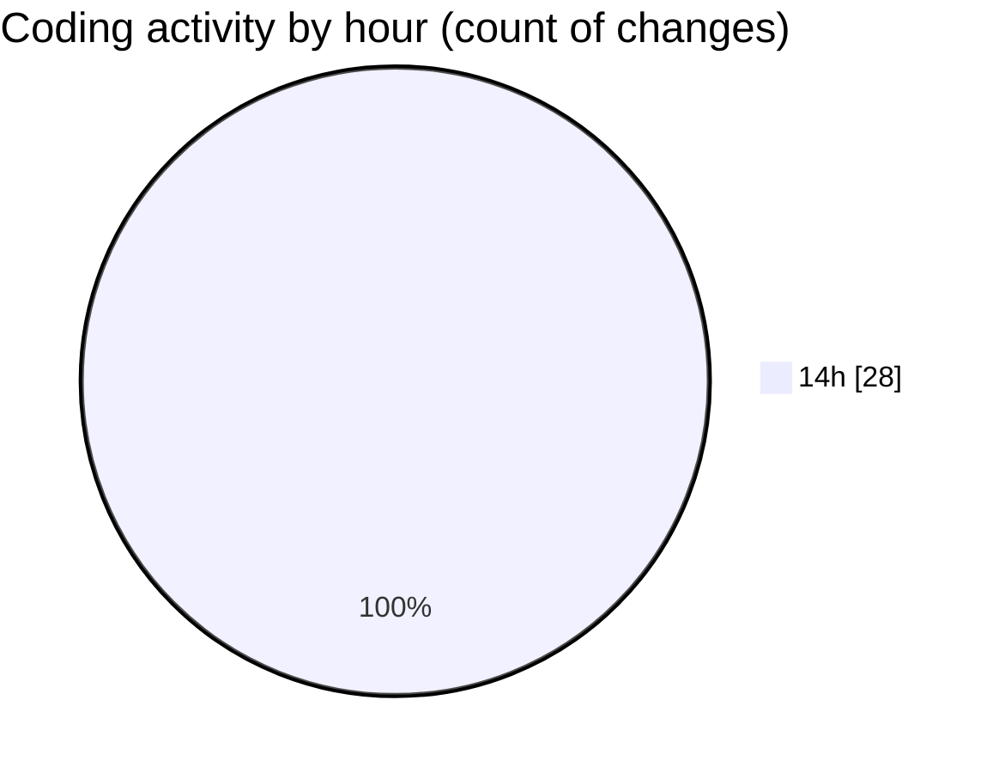

# weather_insights_app - Activity Summary 

## Overall Statistics

| Stat                   | Value                                                             |
| ---------------------- | ----------------------------------------------------------------- |
| **Lines Added** (➕)   | 1954                                          |
| **Lines Removed** (➖) | 2                                        |
| **Net Change** (↕)    | 1952                |
| **Active Time** (⌚)   | 4 minutes |

## Modified Files
- **home_screen.dart** (+852, -0)
- **gradle.properties** (+16, -0)
- **pubspec.yaml** (+190, -0)
- **build.gradle.kts** (+96, -2)
- **build.gradle.kts** (+104, -0)
- **animated_weather_card.dart** (+166, -0)
- **weather_service.dart** (+88, -0)
- **weather_chart.dart** (+58, -0)
- **weather_model.dart** (+280, -0)
- **weather-welcome.json** (+2, -0)
- **.gitignore** (+100, -0)
- **.env.example** (+2, -0)

## Visualizations

### By File Type (Lines Changed)

### By Hour (Estimated Activity Count)

> **Last Updated:** 10/31/2025, 2:55:41 PM