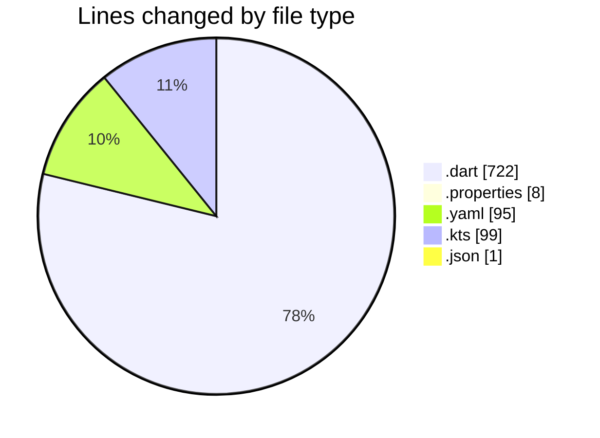

# weather_insights_app - Activity Summary 

## Overall Statistics

| Stat                   | Value                                                             |
| ---------------------- | ----------------------------------------------------------------- |
| **Lines Added** (➕)   | 925                                          |
| **Lines Removed** (➖) | 0                                        |
| **Net Change** (↕)    | 925                |
| **Active Time** (⌚)   | 1 minute |

## Modified Files
- **home_screen.dart** (+426, -0)
- **gradle.properties** (+8, -0)
- **pubspec.yaml** (+95, -0)
- **build.gradle.kts** (+47, -0)
- **build.gradle.kts** (+52, -0)
- **animated_weather_card.dart** (+83, -0)
- **weather_service.dart** (+44, -0)
- **weather_chart.dart** (+29, -0)
- **weather_model.dart** (+140, -0)
- **weather-welcome.json** (+1, -0)

## Visualizations

### By File Type (Lines Changed)

### By Hour (Estimated Activity Count)

> **Last Updated:** 10/31/2025, 2:19:50 PM