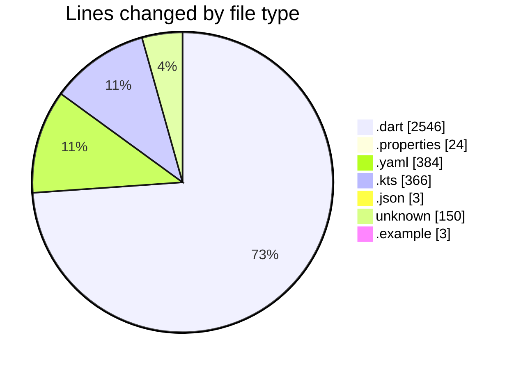
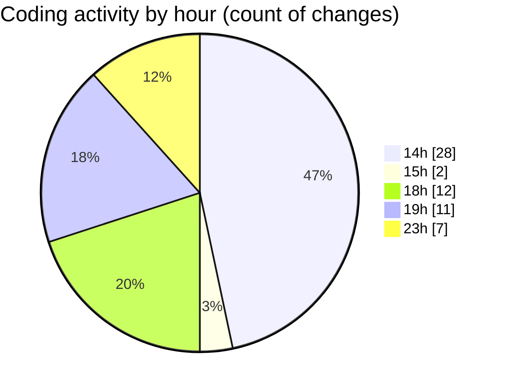

# weather_insights_app - Activity Summary 

## Overall Statistics

| Stat                   | Value                                                             |
| ---------------------- | ----------------------------------------------------------------- |
| **Lines Added** (➕)   | 3465                                          |
| **Lines Removed** (➖) | 11                                        |
| **Net Change** (↕)    | 3454                |
| **Active Time** (⌚)   | 18 minutes |

## Modified Files
- **home_screen.dart** (+1278, -0)
- **gradle.properties** (+24, -0)
- **pubspec.yaml** (+384, -0)
- **build.gradle.kts** (+202, -8)
- **build.gradle.kts** (+156, -0)
- **animated_weather_card.dart** (+411, -0)
- **weather_service.dart** (+153, -1)
- **weather_chart.dart** (+87, -0)
- **weather_model.dart** (+463, -0)
- **weather-welcome.json** (+3, -0)
- **.gitignore** (+150, -0)
- **.env.example** (+3, -0)
- **location_service.dart** (+43, -0)
- **geocoding_service.dart** (+40, -0)
- **cache_service.dart** (+37, -1)
- **weather_model_test.dart** (+31, -1)

## Visualizations

### By File Type (Lines Changed)

### By Hour (Estimated Activity Count)

> **Last Updated:** 10/31/2025, 11:51:07 PM