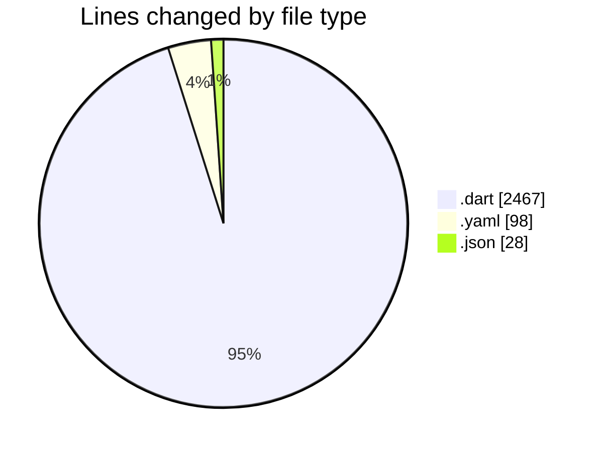
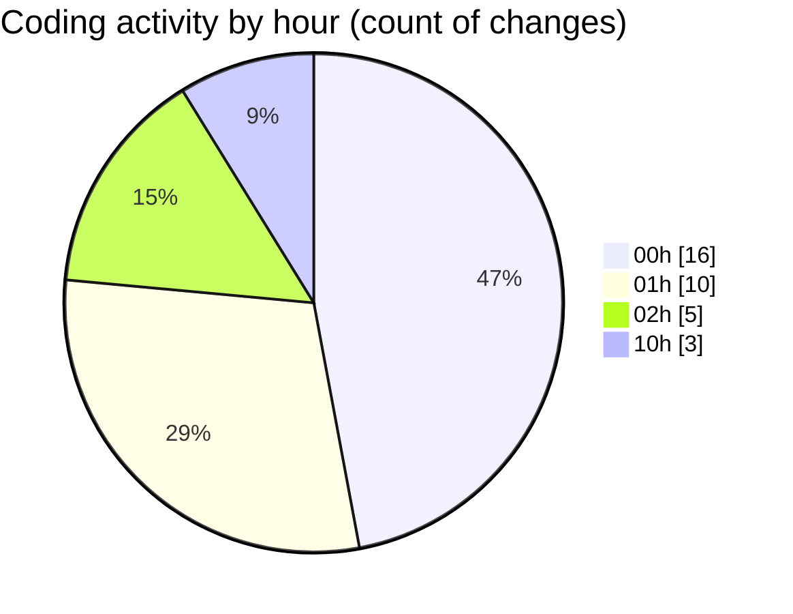

# weather_insights_app - Activity Summary 

## Overall Statistics

| Stat                   | Value                                                             |
| ---------------------- | ----------------------------------------------------------------- |
| **Lines Added** (➕)   | 2448                                          |
| **Lines Removed** (➖) | 145                                        |
| **Net Change** (↕)    | 2303                |
| **Active Time** (⌚)   | 42 minutes |

## Modified Files
- **weather_details_screen.dart** (+566, -2)
- **weather_chart.dart** (+130, -0)
- **home_screen.dart** (+1426, -142)
- **pubspec.yaml** (+98, -0)
- **ThemeMode.system.dart** (+30, -0)
- **main.dart** (+76, -1)
- **theme_switcher.dart** (+26, -0)
- **widget_test.dart** (+66, -0)
- **settings.json** (+28, -0)
- **AdvancedChartsScreen.dart** (+1, -0)
- **advanced_charts_screen.dart** (+1, -0)

## Visualizations

### By File Type (Lines Changed)

### By Hour (Estimated Activity Count)

> **Last Updated:** 11/1/2025, 10:44:21 AM