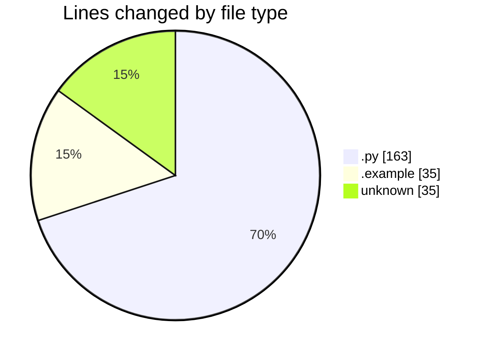
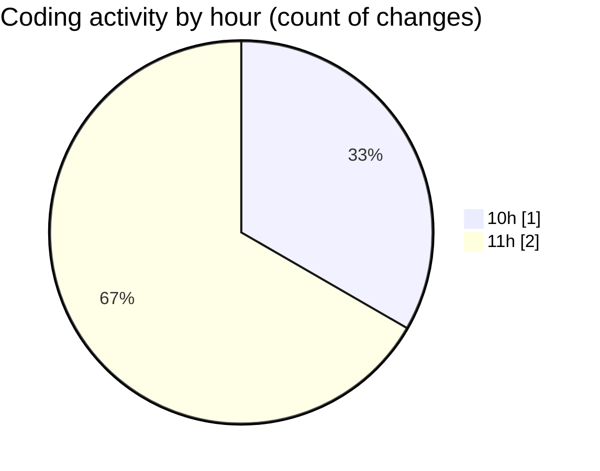

# kouma_backend - Activity Summary 

## Overall Statistics

| Stat                   | Value                                                             |
| ---------------------- | ----------------------------------------------------------------- |
| **Lines Added** (➕)   | 233                                          |
| **Lines Removed** (➖) | 0                                        |
| **Net Change** (↕)    | 233                |
| **Active Time** (⌚)   | 0 minute |

## Modified Files
- **routes.py** (+163, -0)
- **.env.example** (+35, -0)
- **.env** (+35, -0)

## Visualizations

### By File Type (Lines Changed)

### By Hour (Estimated Activity Count)

> **Last Updated:** 01/10/2026 11:37:03